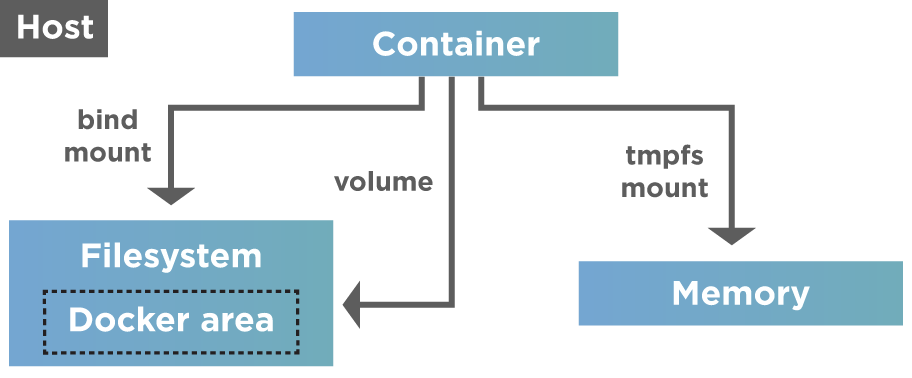

# docker_setups

## Motivation

The goal of this project - is to collect the main development tools, and examples how to use them with docker

Here you'll see:

- RabbitMQ
- PostgreSql
- Hadoop

and many other popular things.

This repo I've done to myself, in order to speed up the search for information how to do a certain thing.

## Docker container start automatically

After installing docker and launching the first container, you don't immediately think that after restarting the server
container won't start by itself.

| Politics                 | Description                                                                                                                                                                   | 
|--------------------------|-------------------------------------------------------------------------------------------------------------------------------------------------------------------------------| 
| on                       | Do not reload the container automatically (by default)                                                                                                                    |
| on-failure[:max-retries] | Restart the container if it stops due to an error. ptionally, limit the number of times the Docker daemon attempts to restart the container using the :max-retries option | 
| always                   | Always restart the container if it stops. If it is manually stopped, it is restarted only when Docker daemon restarts or the container itself is manually restarted           | 
| unless-stopped           | Similar to always, except that when the container is stopped (manually or otherwise), it is not restarted even after Docker daemon restarts                                   | 

_docker-compose:_

~~~docker
restart: unless-stopped
~~~

_In creation:_

~~~
docker run --restart unless-stopped mycontainer
~~~

_If container already created:_

~~~
docker update –restart unless-stopped mycontainer
~~~

## How to manage data in Docker

When we delete a Docker container, all the data associated or written to the container is deleted with it. So there is a
need to persist the container data somehow even when the container gets deleted so that we need not worry about data and
persist this data after the container ceases to exist.

As shown above, Docker provides two options for data persistence so that files are persisted even after the container
stops.

- Volumes
- Mounts

**Volumes** are directories or files that are outside the Union file system(the combination of read-only layers with a
read-write layer on top of the container). Volumes exist/ store as normal files and directories on the host
filesystem. Hence to persist and share data between containers, Docker uses Volumes. Volumes are the best option to
persist data in Docker containers. Docker manages volumes and is stored in a part of the host filesystem (
/var/lib/docker/volumes/ on Linux).

**Bind mount**
Это более простая концепция: файл или каталог с хоста просто монтируется в контейнер.
Используется, когда нужно пробросить в контейнер конфигурационные файлы с хоста. Например, именно так в контейнерах
реализуется DNS: с хоста монтируется файл /etc/resolv.conf.
Другое очевидное применение — в разработке. Код находится на хосте (вашем ноутбуке), но исполняется в контейнере. Вы
меняете код и сразу видите результат. Это возможно, так как процессы хоста и контейнера одновременно имеют доступ к
одним и тем же данным.

**Tmpfs mounts** are used mainly by Docker running on Linux systems. Their storage is in the host system’s memory only.
Additionally, we never write the tmpfs mounts to the host system’s filesystem. Contrary to volumes and bind mounts,
the "tmpfs" mount is temporary and only persisted in the host memory. When the container stops, the "tmpfs" mount
removes, and files written there won’t persist.

## Expose ports

~~~dockerfile
version: "3.9"
services:
  web:
    build: .
    ports:
    # HOST_PORT:CONTAINER_PORT
      - "8000:8000"
  db:
    image: postgres
    ports:
      - "8001:5432"
~~~

It is important to note the distinction between HOST_PORT and CONTAINER_PORT.
In the above example, for db, the HOST_PORT is 8001 and the container port is 5432 (postgres default).

**Networked service-to-service communication uses the CONTAINER_PORT.**

**When HOST_PORT is defined, the service is accessible outside the docker as well.**

Within the web container, your connection string to db would look like postgres://db:5432,
and from the host machine, the connection string would look like postgres://{DOCKER_IP}:8001.

## Tips

Using the PUID and PGID allows our containers to map the container's internal user to a user on the host machine. All of
our containers use this method of user mapping and should be applied accordingly.

~~~
- PUID=1000
- PGID=1000
~~~

### Bash into a running container

~~~bash
docker ps
~~~

~~~
CONTAINER ID   IMAGE           COMMAND                  CREATED        STATUS          PORTS                    NAMES
44bf2e32249f   postgres:14.0   "docker-entrypoint.s…"   4 months ago   Up 15 minutes   0.0.0.0:5432->5432/tcp   postgresql_postgres_1
~~~

~~~bash
docker exec -ti 44bf2e32249f /bin/bash
~~~

# k8s

## Абстракции

*Pod* - это объединение из нескольких контейнеров. Даже если нам нужно запустить всего один - кубер поднимет минимум 2.

container Pod несёт в себе linux network namespace. Причём он запускается первым, а потом уже подтягивается приложение.

*Replica set* - то, что позволяет подам внутри кластера масштабироваться.
Абстракция над подом, которая позволяет создавать новые поды по заданному шаблону.

Обновив шаблон в replicaset - изменения не применятся сразу же, а будут применяться уже к новым подам.

Пример описания ReplicaSet:

~~~yaml
apiVersion: apps/v1
kind: ReplicaSet
metadata:
  name: frontend
  labels:
    app: guestbook
    tier: frontend
spec:
  replicas: 3
  selector:
    matchLabels:
      tier: frontend
    matchExpressions:
      - { key: tier, operator: In, values: [ frontend ] }
  template:
    metadata:
      labels:
        app: guestbook
        tier: frontend
    spec:
      containers:
        - name: php-redis
          image: gcr.io/google_samples/gb-frontend:v3
          resources:
            requests:
              cpu: 100m
              memory: 100Mi
          env:
            - name: GET_HOSTS_FROM
              value: env
          ports:
            - containerPort: 80
~~~

Предложенный манифест можно сохранить в файл frontend.yaml и запустить в кластере Kubernetes с помощью утилиты командной
строки:

~~~bash
kubectl create -f frontend.yaml
~~~

*Deployment* - абстракция более высокого уровня, которая управляет ReplicaSet и предоставляет расширенный
функционал управления контейнерами.

Контроллер развертывания (Deployment controller) предоставляет возможность декларативного обновления для объектов типа
поды (Pods) и наборы реплик (ReplicaSets). Давайте разберемся!

Достаточно описать желаемое состояние [подов/реплик] в объекте Deployment, после чего контроллер развертывания изменит
текущее состояние объектов на желаемое в контролируемом режиме. Стоит отметить, что при манипуляциях с развертываниями (
Deployments) нам не нужно беспокоиться об управлении наборами реплик (ReplicaSets) - все необходимое будет выполнено
непосредственно контроллером развертывания.

### Rolling update

A rolling update allows a Deployment update to take place with zero downtime. It does this by incrementally replacing
the current Pods with new ones . The new Pods are scheduled on Nodes with available resources, and Kubernetes waits for
those new Pods to start before removing the old Pods.

То есть у нас существуют старые реплики, какое-то их количество гасится, на их место поднимаются новые реплики. Новые
постепенно занимают старые и тд, поэтому замена происходит бесшовно, незаметно для пользователя.

Это стратегия k8s по умолчанию, но процесс обновления в Deployment можно контролировать через .spec.strategy

maxSurge. Когда начнётся rolling update - мы можем тут же поднять одну новую реплику.
И в общем количестве иметь replicas+maxSurge.
maxUnavailable. Одну старую реплику можно удалить.
При обоих параметрах реплик у нас останется 2: одна новая и одна старая.

Можно указывать в %х.
А если 1 реплика? как сделать обновление без downtime?

~~~yaml
maxSurge: 1
maxUnavailable: 0
~~~

~~~yaml
apiVersion: apps/v1
kind: Deployment
metadata:
  name: my-deployment
spec:
  replicas: 1
  selector:
    matchLabels:
      app: my-app
  strategy:
    rollingUpdate:
      maxSurge: 1
      maxUnavailable: 1
    type: RollingUpdate
  template:
    metadata:
      labels:
        app: my-app
~~~

### Secrets

*Generic* - пароли и ключи

~~~bash
kubectl create secret generic test --from-literal=test1=asdf --from-literal=dbpassword=1q2w3e
kubectl get secret
kubectl get secret test -o yaml
~~~

Подключение secret:

~~~bash
- name: TEST_1
  valueFrom: # Взять значение из secret. envFrom - подключить секретницу целиком
    secretKeyRef:
      name: test
      key: test1
~~~

secret лишь кодирует пароль, а не шифрует:

Через манифест:

~~~yaml
apiVersion: v1
kind: Secret
metadata:
  name: test
stringData:
  test: updated

~~~

### Downward API

Позволяет передать приложению некоторые параметры манифестов как переменные окружения или как файлы.

~~~yaml
env:
  - name: TEST
    value: foo
  - name: TEST_1
    valueFrom:
      secretKeyRef:
        name: test
        key: test1
  - name: __NODE_NAME
    valueFrom:
      fieldRef:
        fieldPath: spec.nodeName
  - name: __POD_NAME
    valueFrom:
      fieldRef:
        fieldPath: metadata.name
  - name: __POD_NAMESPACE
    valueFrom:
      fieldRef:
        fieldPath: metadata.namespace
  - name: __POD_IP
    valueFrom:
      fieldRef:
        fieldPath: status.podIP
  - name: __NODE_IP
    valueFrom:
      fieldRef:
        fieldPath: status.hostIP
  - name: __POD_SERVICE_ACCOUNT
    valueFrom:
      fieldRef:
        fieldPath: spec.serviceAccountName
~~~

## volumes

### HostPath

*Самый опасный вариант*

~~~
spec:
      containers:
      - image: nginx:1.20
        name: nginx
        ports:
        - containerPort: 80
        resources:
          requests:
            cpu: 50m
            memory: 100Mi
          limits:
            cpu: 100m
            memory: 100Mi
        volumeMounts:
        - name: data
          mountPath: /files
      volumes:
      - name: data
        hostPath:
          path: /data_pod

~~~

### EmptyDir

Автоматически создаваемая папка где-то на сервере под контейнер, чтобы записывать туда данные.
Каталог существует пока существует Pod. При удалении pod-a удалится и директория.

~~~yaml
volumeMounts:
  - name: data
    mountPath: /files
  volumes:
    - name: data
      emptyDir: { }
~~~

### PV/PVC - persistent volume

Для подключения внешнего хранилища

## Структура Pod-а

В общем виде можно выделить 4 вида дополнительных «полезных» контейнеров:

* Init;
* Sidecar;
* Adapter;
* Ambassador.

### initContainers

* Позволяет выполнить настройку перед запуском основного приложения
* Выполняется по порядку описания в манифесте
* Можно монтировать те же тома, что и в основных контейнерах
* Можно запускать от другого пользователя
* Должен выполнить действие и остановиться

### Sidecar Containers

В общем случае sidecar-контейнер — это контейнер с законченной функциональностью, которая нужна приложению, но не
является частью его бизнес-логики. За счёт такого разделения разработчики могут фокусироваться на одной задаче.
Платформенная команда отвечает за дополнительные возможности, например, делает приложение более отказоустойчивым,
надёжным. В свою очередь прикладные разработчики занимаются исключительно бизнес-логикой приложения.

Sidecar-контейнеры чаще всего используются для добавления платформенной функциональности, например:

* Service Mesh — в этом случае добавляется сетевой прокси, который обрабатывает все запросы, добавляет observability,
  делает mutual TLS и остальные полезные вещи.
* Журналирование, если вам по каким-то причинам не нравится решение собирать логи через daemon, который бежит на воркере
  Kubernetes и забирает данные сразу с контейнерного runtime'а.
* Централизованный аудит.

### Adapter Containers

Адаптеры — такие же sidecar’ы, но узкоспециализированные. Они используются тогда, когда в приложение нужно добавить
новый API, но не хочется (или не получается) сделать это на уровне приложения.

* Metrics API. Есть система мониторинга на базе Prometheus и приложение, которое про эту систему мониторинга вообще
  ничего
  не знает. У этого приложения есть либо только свои метрики, либо нет вообще нет никаких. Для «неинвазивного» решения
  проблемы достаточно добавить Prometheus экспортер отдельным контейнером, который опубликует все нужные метрики в
  правильном формате.
* Custom API. Позволяет добавить произвольный API по аналогии с примером метрик.
* RBAC Proxy. Дополнительный контейнер становится точкой входа в приложение и добавляет стандартный RBAC Kubernetes. Это
  делается очень быстро и во многих случаях бывает полезно.

### Ambassador Containers

Эти контейнеры похожи на адаптеры, но работают в обратную сторону: они инкапсулируют в себя всю сложность внешнего API и
позволяют использовать его понятным для приложения способом.

## Команды:

Создание объекта:

~~~bash
kubectl create -f pod.yaml
~~~

Создание или обновление объекта:

~~~bash
kubectl apply -f pod.yaml
~~~

Просмотр подов:

~~~bash
kubectl get pod
-w # в реальном времени как поднимается под
~~~

Просмотр ReplicaSet

~~~bash
kubectl get rs
~~~

Просмотр configmap:

~~~bash
kubectl get cm
~~~

Просмотр services:

~~~bash
kubectl get svc
~~~

Описание:

~~~bash
kubectl describe pod {pod_name}
kubectl describe cm {configmap name}
~~~

Объяснить объект k8s:

~~~bash
kubectl explain deployment.spec.strategy
kubectl get po <ИМЯ НОВОГО POD'а> -o=jsonpath='{.spec.containers[*].image}{"\n"}'
~~~

Выполнение команды внутри пода:

~~~bash
kubectl exec -t -i {pod_name} {command}
~~~

Просмотр логов:

~~~bash
kubectl logs {pod_name}
~~~

Содержимое манифеста:

~~~bash
kubectl get {cm/pod} {name} -o yaml
~~~

Открытие портов:

~~~bash
kubectl port-forward {pod_name} {port to local}:{port app works} &
~~~

& - чтобы работал в фоне

Pod для тестов:

~~~bash
kubectl run test  --image=amount/network-utils -it bash
~~~