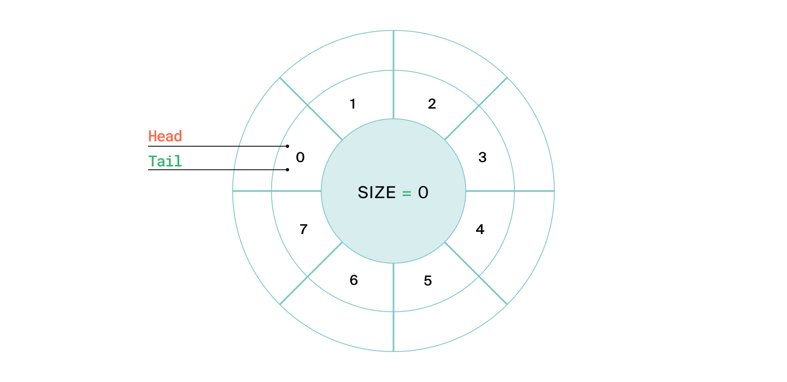
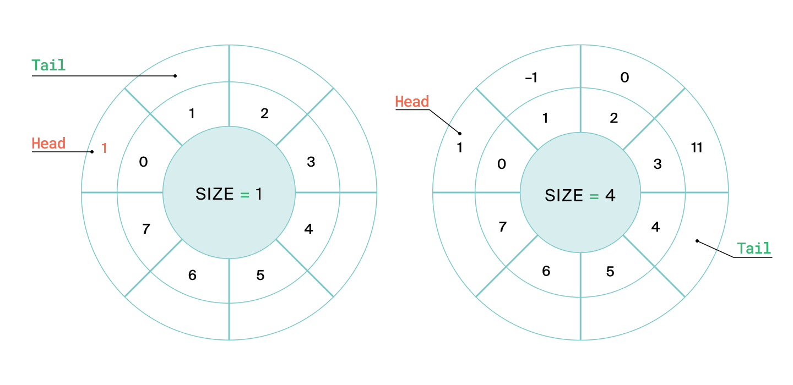
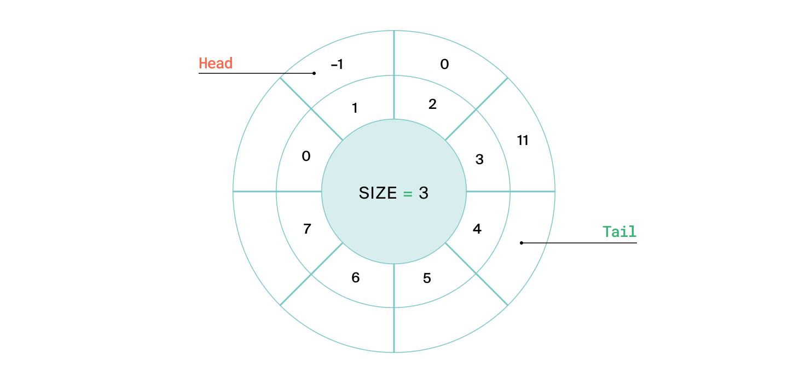
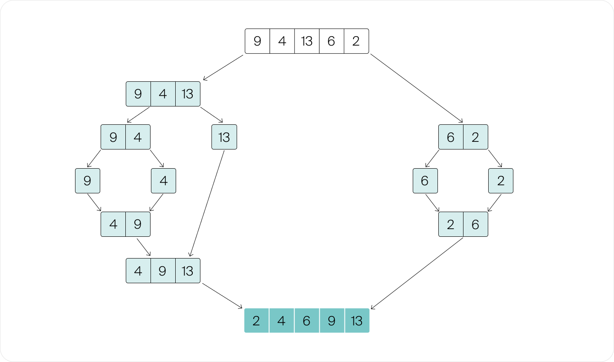
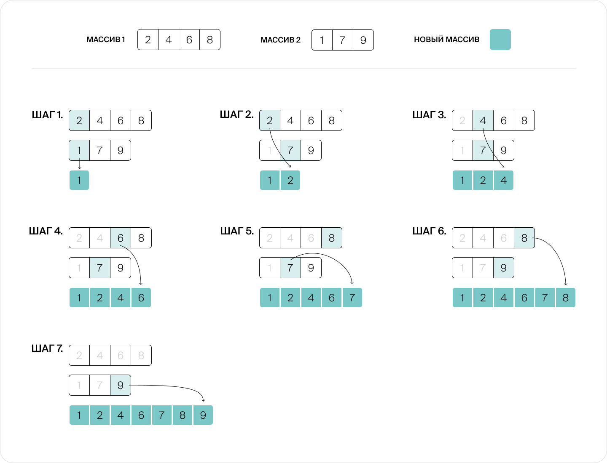

# Структуры данных

## Очередь на кольцевом буфере

[queue_on_circle_buffer.py](queue_on_circle_buffer.py)

В пустой очереди и голова, и хвост указывают на ячейку с индексом 0:

После добавления элемента увеличиваем значение поля tail, и новый элемент будет записываться в следующую ячейку.
Значение tail берётся по модулю max_n. Это делается для того, чтобы первая ячейка следовала за последней.

Хвост всегда указывает на первую свободную для записи ячейку, а голова — на элемент, добавленный в очередь раньше всех
остальных

При извлечении удаляется добавленный ранее всех элемент. Значение поля head изменяется аналогично полю tail в методе
push(). Если мы удалили элемент на какой-то позиции i в массиве, то в следующий раз нужно извлекать из ячейки i+1 по
циклу.

После удаления элемента голова продолжает указывать на элемент, который находится в очереди дольше всех из оставшихся

# Поиск

## Бинарный поиск O(log N)

~~~python
def binary_search_iterative(arr, target):
    # Определить границы поиска
    left, right = 0, len(arr) - 1
    while left <= right:
        # Вычислить серединный индкс
        mid = left + (right - left) // 2
        # Если средний элемент является искомым, вернуть его индекс
        if arr[mid] == target:
            return mid
            # Если искомый элемент больше, сузить поиск до правой половины
        elif arr[mid] < target:
            left = mid + 1
            # Если искомый элемент меньше, сузить поиск до левой половины
        else:
            right = mid - 1
            # Вернуть -1, если цель не найдена
    return -1 
~~~

# Сортировки

Python по умолчанию использует Timsort. Представляет из себя гибрид сортировок Слияними и Вставок.

- Stable sort (maintains relative order of equal elements)
- Adaptive (performs better on partially sorted data)
- Iterative, not recursive
- Uses O(n) extra space
- Has O(n log n) worst-case complexity
- Has O(n) best-case complexity when data is already sorted

## Собственный компаратор

Сортировка словаря по значениям с выводом ключей:

~~~python
def sort_dict_keys(d: dict) -> list:
    return [k for k, v in sorted(d.items(), key=lambda x: (-x[1], int(x[0])))]

# Пример использования
data = {'1': 2, '3': 2, '2': 4}
result = sort_dict_keys(data)
print(result)  # ['2', '1', '3']
~~~

Сравниваем одновременно и по длине слова и по номиналу карты

~~~python
digit_lengths = [4, 4, 3, 3, 6, 4, 5, 4, 6, 6]  # длины слов «ноль», «один»,...

def key_for_card(card):
    return [-digit_lengths[card], card]

cards = [2, 3, 7]
cards.sort(key=key_for_card)
print(cards)
~~~

* return a negative value (< 0) when the left item should be sorted before the right item
* return a positive value (> 0) when the left item should be sorted after the right item
* return 0 when both the left and the right item have the same weight and should be ordered "equally" without precedence

~~~python
from functools import cmp_to_key

def compare_sections(a: list[int], b: list[int]) -> int:
    res: int = a[0] - b[0]
    if res == 0:
        return a[1] - b[1]
    return res

arr.sort(key=cmp_to_key(compare_sections))
~~~

## Сортировка двух отсортированных массивов слияниями (N logN)

В общем виде:

1) Массив разбивается на две части примерно одинакового размера.
2) Если в каком-то из получившихся подмассивов больше одного элемента, то для него рекурсивно запускается сортировка по
   этому же алгоритму, начиная с пункта 1.
3) Два упорядоченных массива соединяются в один. `O(k+n)`

Слияния: 

~~~python
res = []
i, j = 0, 0  # индексы массивов nums1 и nums2

while i < m and j < n:
    if nums1[i] == nums2[j]:
        res.append(nums1[i])
        res.append(nums2[j])

        i += 1
        j += 1
        continue

    if nums1[i] < nums2[j]:
        res.append(nums1[i])
        i += 1
    else:
        res.append(nums2[j])
        j += 1

if j < n:
    res += nums2[j:]
if i < m:
    res += nums1[i:m]
~~~

# Интересные задачи

## Разложение на множители

Решается за О(sqrt(n)).

Пусть n = 36. Его делители по парам:
• 1 x 36
• 2 x 18
• 3 x 12
• 4 x 9
• 6 x 6

После 6, делители начинают повторяться в обратном порядке. То есть, если ты проверил делители до sqrt{n}, ты уже
фактически проверил всё.

~~~python
def Factor(n):
    Ans = []
    d = 2
    while d * d <= n:
        if n % d == 0:
            Ans.append(d)
            n //= d
        else:
            d += 1
    if n > 1:
        Ans.append(n)
    return Ans
~~~