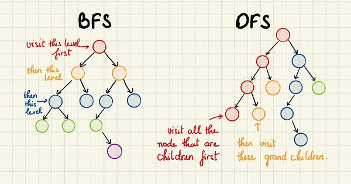

# Бинарные деревья

Бинарные деревья являются деревьями со степенью не более двух: не более 2х потомков

Сравнение BFS и DFS:

Обычно стоит использовать:

* BFS, когда нужно найти кратчайший путь от конкретного исходного узла к нужной точке. Иначе говоря, когда нас интересует
путь с наименьшим числом шагов, ведущих от заданного начального состояния к искомому.
* DFS, когда нужно исследовать все возможности и найти наилучшую либо пересчитать количество возможных путей.
* BFS или DFS, когда нужно только проверить наличие связи между двумя узлами представленного графа или, иначе говоря,
узнать, можем ли мы достичь одного, находясь в другом.

## Поиск в глубину (DFS — Depth-First Search)

https://nuancesprog.ru/p/9284/

Использует стек (в рекурсивной реализации стеком является сама рекурсия).

Способы:

### Pre-order (Прямой обход):

Пока все узлы не будут посещены
Шаг 1 − Посещение корневого узла
Шаг 2 − Рекурсивный обход левого поддерева
Шаг 3 − Рекурсивный обход правого поддерева

### In-order (Симметричный обход):

Пока все узлы не будут посещены
Шаг 1 − Рекурсивный обход левого поддерева
Шаг 2 − Посещение корневого узла
Шаг 3 − Рекурсивный обход правого поддерева

### Post-order (Обратный обход):

Пока все узлы не будут посещены
Шаг 1 − Рекурсивный обход левого поддерева
Шаг 2 − Рекурсивный обход правого поддерева
Шаг 3 − Посещение корневого узла

## Поиск в глубину (DFS)

В этом способе мы всегда посещаем самый углублённый узел, затем идём назад и следуем другим путём, достигая другого
конечного узла.

2 массива:

* visited с пройденными узлами
* stack с порядком прохода

Помечаем узел A как посещённый и смотрим, есть ли среди смежных с ним узлов непосещённые. Есть два таких узла, помещаем
их в стек и далее выбираем любой из них. Здесь будем следовать алфавитному порядку.

Помечаем B как посещённый и далее смотрим, есть ли у него соседи, которых мы ещё не посетили. Их два — D и E. Добавляем
их в стек.

Посещаем D и отмечаем его. У этого узла нет не посещённых соседей, поэтому в стек ничего не добавляем.

Проверяем верхушку стека и через возврат к предыдущему узлу посещаем E. Затем также проверяем наличие непосещённых
соседей у него.

## Поиск в ширину (BFS — Breadth-First Search)

* Использует очередь.
* Идём “по уровням”: сначала корень, потом все его дети, потом их дети и так далее.

Алгоритм:

1. Поместить корень в очередь.
2. Пока очередь не пуста:

* Достать вершину из очереди.
* Обработать её.
* Положить в очередь её детей (сначала левого, потом правого).

[bfs.py](bfs.py)