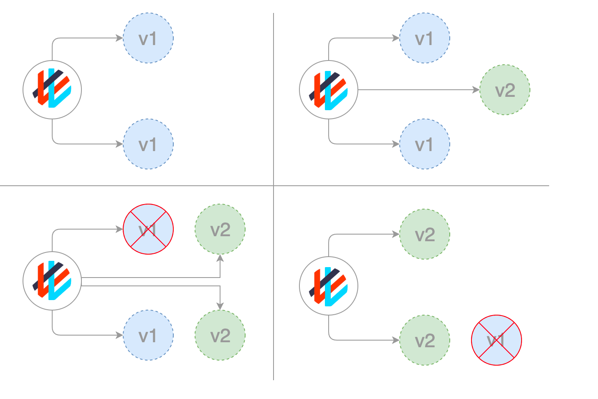
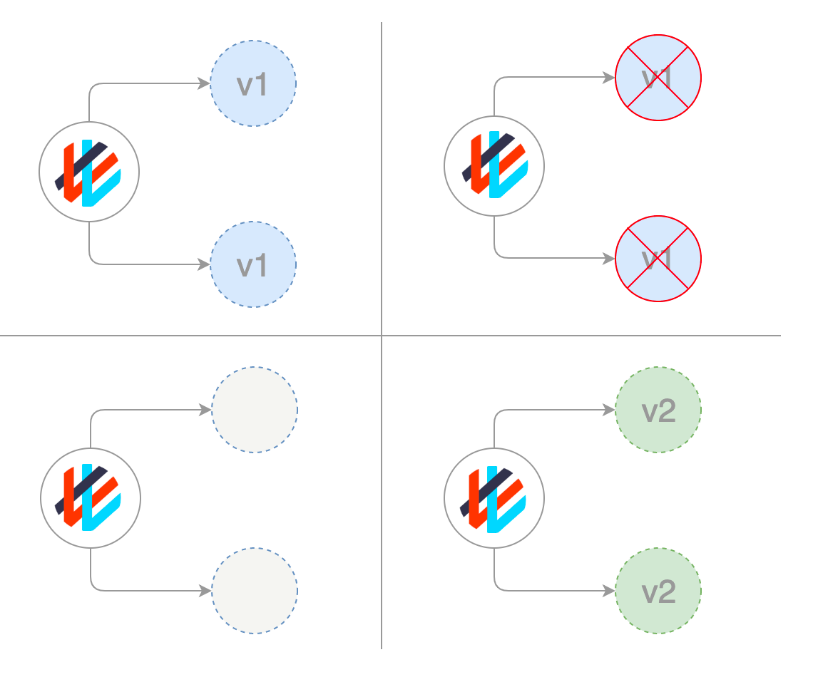
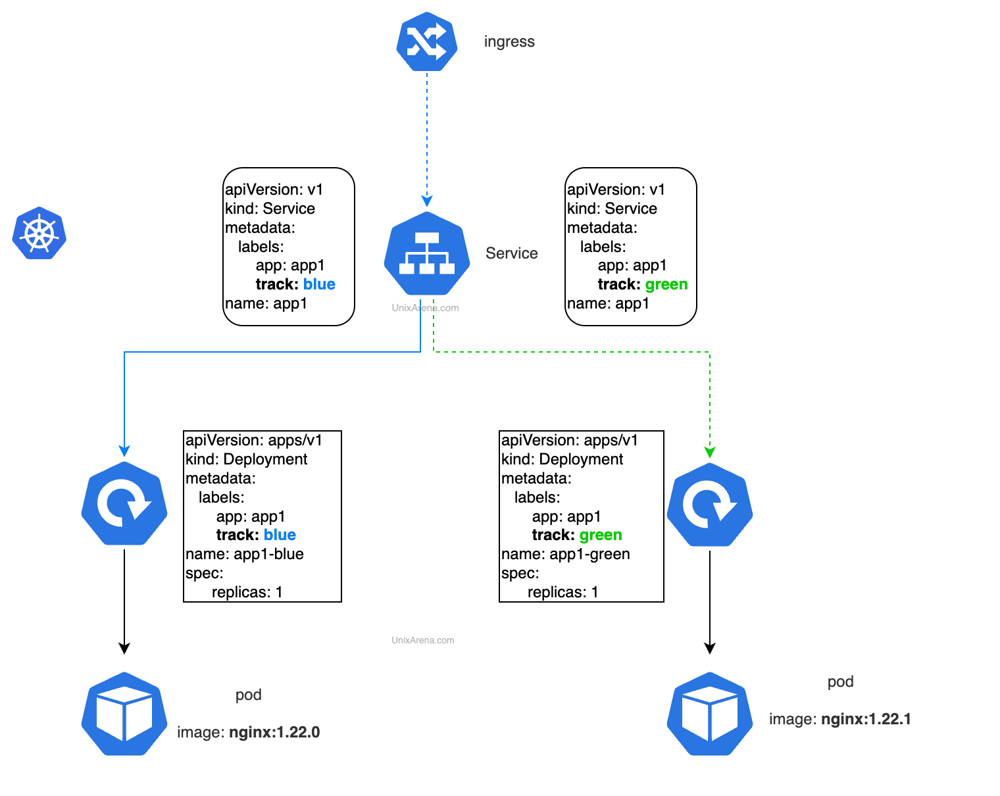
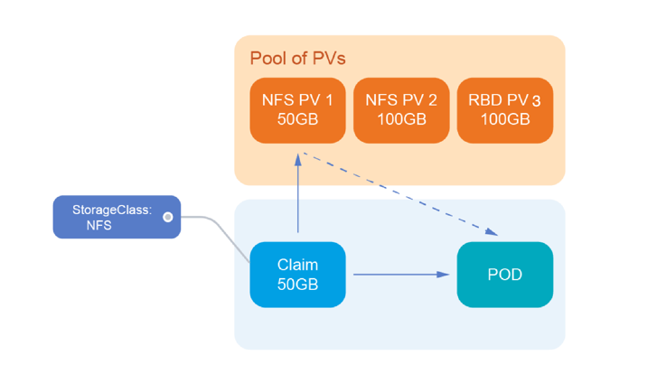
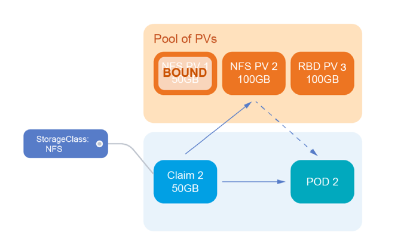
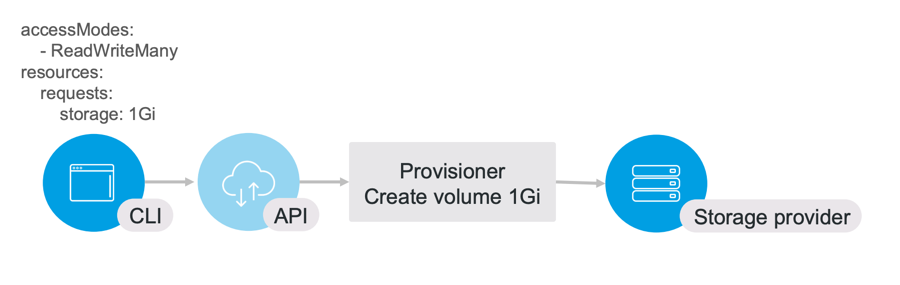
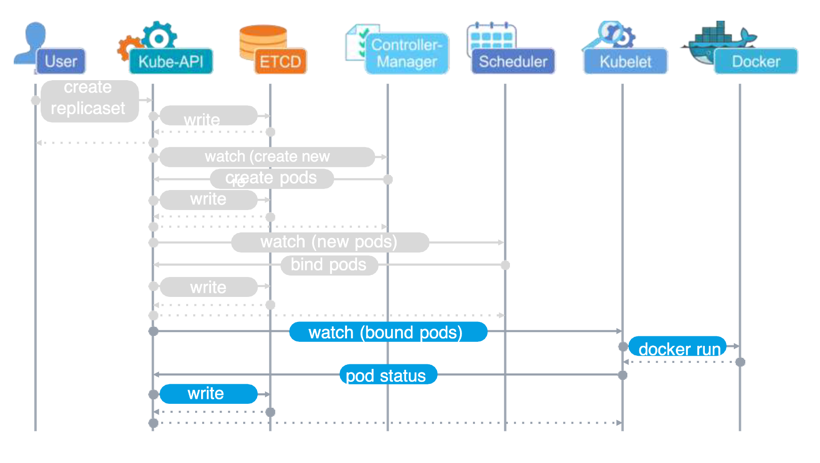

# Оглавление

* [Оглавление](https://github.com/mixa2130/docker_setups/blob/master/k8s/README.md#оглавление)
* [Абстракции](https://github.com/mixa2130/docker_setups/blob/master/k8s/README.md#абстракции)
    * [Pod](https://github.com/mixa2130/docker_setups/blob/master/k8s/README.md#pod)
    * [Namespace](https://github.com/mixa2130/docker_setups/blob/master/k8s/README.md#namespace)
    * [Deployment](https://github.com/mixa2130/docker_setups/blob/master/k8s/README.md#deployment)
        * [Стратегии деплоя](https://github.com/mixa2130/docker_setups/blob/master/k8s/README.md#стратегии-деплоя)
            * [Rolling update](https://github.com/mixa2130/docker_setups/blob/master/k8s/README.md#rolling-update)
            * [Recreate](https://github.com/mixa2130/docker_setups/blob/master/k8s/README.md#recreate)
            * [Blue/Green](https://github.com/mixa2130/docker_setups/blob/master/k8s/README.md#blue/green)
            * [Canary](https://github.com/mixa2130/docker_setups/blob/master/k8s/README.md#canary)
        * [Resources](https://github.com/mixa2130/docker_setups/blob/master/k8s/README.md#resources)
            * [Memory](https://github.com/mixa2130/docker_setups/blob/master/k8s/README.md#memory)
            * [CPU](https://github.com/mixa2130/docker_setups/blob/master/k8s/README.md#cpu)
            * [Qos class](https://github.com/mixa2130/docker_setups/blob/master/k8s/README.md#qos-class)
        * [Secrets](https://github.com/mixa2130/docker_setups/blob/master/k8s/README.md#secrets)
            * [ENV](https://github.com/mixa2130/docker_setups/blob/master/k8s/README.md#env)
            * [ConfigMap](https://github.com/mixa2130/docker_setups/blob/master/k8s/README.md#configmap)
            * [Secrets](https://github.com/mixa2130/docker_setups/blob/master/k8s/README.md#secrets)
        * [Health Check](https://github.com/mixa2130/docker_setups/blob/master/k8s/README.md#health-check)
            * [httpGET](https://github.com/mixa2130/docker_setups/blob/master/k8s/README.md#httpget)
            * [exec](https://github.com/mixa2130/docker_setups/blob/master/k8s/README.md#exec)
            * [TCP](https://github.com/mixa2130/docker_setups/blob/master/k8s/README.md#tcp)
        * [Downward API](https://github.com/mixa2130/docker_setups/blob/master/k8s/README.md#downward-api)
    * [Service](https://github.com/mixa2130/docker_setups/blob/master/k8s/README.md#service)
        * [ClusterIP](https://github.com/mixa2130/docker_setups/blob/master/k8s/README.md#clusterip)
        * [NodePort](https://github.com/mixa2130/docker_setups/blob/master/k8s/README.md#nodeport)
        * [LoadBalancer](https://github.com/mixa2130/docker_setups/blob/master/k8s/README.md#loadbalancer)
        * [ExternalIPs](https://github.com/mixa2130/docker_setups/blob/master/k8s/README.md#externalips)
        * [Headless](https://github.com/mixa2130/docker_setups/blob/master/k8s/README.md#headless)
    * [Ingress](https://github.com/mixa2130/docker_setups/blob/master/k8s/README.md#ingress)
* [Хранение данных](https://github.com/mixa2130/docker_setups/blob/master/k8s/README.md#хранение-данных)
    * [Volumes](https://github.com/mixa2130/docker_setups/blob/master/k8s/README.md#volumes)
        * [PV - persistent volume](https://github.com/mixa2130/docker_setups/blob/master/k8s/README.md#pv---persistent-volume)
            * [PV Provisioners](https://github.com/mixa2130/docker_setups/blob/master/k8s/README.md#pv-provisioners)
        * [EmptyDir](https://github.com/mixa2130/docker_setups/blob/master/k8s/README.md#emptydir)
        * [HostPath](https://github.com/mixa2130/docker_setups/blob/master/k8s/README.md#hostpath)
* [Устройство кластера](https://github.com/mixa2130/docker_setups/blob/master/k8s/README.md#устройство-кластера)
* [Oneshot задачи](https://github.com/mixa2130/docker_setups/blob/master/k8s/README.md#oneshot-задачи)
    * [Job](https://github.com/mixa2130/docker_setups/blob/master/k8s/README.md#job)
    * [CronJob](https://github.com/mixa2130/docker_setups/blob/master/k8s/README.md#cronjob)
* [DaemonSet](https://github.com/mixa2130/docker_setups/blob/master/k8s/README.md#daemonset)
    * [Tolerations](https://github.com/mixa2130/docker_setups/blob/master/k8s/README.md#tolerations)
* [Настройка кластера](https://github.com/mixa2130/docker_setups/blob/master/k8s/README.md#настройка-кластера)
    * [Подключение хранилищ образов registry](https://github.com/mixa2130/docker_setups/blob/master/k8s/README.md#подключение-хранилищ-образов-registry)
        * [Создание secret](https://github.com/mixa2130/docker_setups/blob/master/k8s/README.md#создание-secret)
            * [Вариант 1](https://github.com/mixa2130/docker_setups/blob/master/k8s/README.md#вариант-1)
            * [Вариант 2](https://github.com/mixa2130/docker_setups/blob/master/k8s/README.md#вариант-2)
            * [Вариант 3](https://github.com/mixa2130/docker_setups/blob/master/k8s/README.md#вариант-3)
        * [Добавление к Deployment](https://github.com/mixa2130/docker_setups/blob/master/k8s/README.md#добавление-к-deployment)
        * [Добавление к ServiceAccount](https://github.com/mixa2130/docker_setups/blob/master/k8s/README.md#добавление-к-serviceaccount)
* [k8s dashboard](https://github.com/mixa2130/docker_setups/blob/master/k8s/README.md#k8s-dashboard)
* [Полезные ссылки](https://github.com/mixa2130/docker_setups/blob/master/k8s/README.md#полезные-ссылки)

# Абстракции

* Namespace — пространство имен. Объекты могут взаимодействовать, только если находятся в одном namespace. С помощью
  namespace возможно развернуть несколько виртуальных кластеров на одном физическом.
* Pod — минимальный юнит развертывания. Это объединение из нескольких контейнеров. Даже если нам нужно запустить всего
  один - кубер поднимет минимум 2.
* ReplicaSet — контроллер, позволяющий создать набор одинаковых подов и работать с ними, как с единой сущностью.
  Поддерживает нужное количество реплик, при необходимости создавая новые поды или убивая старые. На самом деле в
  большинстве случаев вы не будете работать с ReplicaSet напрямую — для этого есть Deployment.
* Deployment — контроллер развертывания, являющийся абстракцией более высокого уровня над ReplicaSet'ом. Добавляет
  возможность обновления управляемых подов.
* Service — отвечает за сетевое взаимодействие группы подов. В системе обычно существует несколько экземляров одного
  микросервиса, соответственно каждый из них имеет свой IP-адрес. Количество подов может изменяться, следовательно набор
  адресов также не постоянен. Другим частям системы для доступа к рассматриваемым подам нужен какой-то статичный адрес,
  который Service и предоставляет.
* Ingress сам по себе не сервис. Он стоит перед несколькими сервисами и действует как «интеллектуальный маршрутизатор»
  или точка вхождения в кластер.
* ConfigMap — объект с произвольными конфигурациями, которые могут, например, быть переданы в контейнеры через
  переменные среды.
* Secret — объект с некой конфиденциальной информацией. Секреты могут быть файлами (№ SSL-сертификатами), которые
  монтируются к контейнеру, либо же base64-закодированными строками, передающимися через те же переменные среды.
* HorizontalPodAutoscaler — объект, предназначенный для автоматического изменения количества подов в зависимости от их
  загруженности.

## Pod

container Pod несёт в себе linux network namespace. Причём он запускается первым, а потом уже подтягивается приложение.


## Namespace

~~~
kubectl create namespace coolapp
~~~

## Deployment

Достаточно описать желаемое состояние [подов/реплик] в объекте Deployment, после чего контроллер развертывания изменит
текущее состояние объектов на желаемое в контролируемом режиме. Стоит отметить, что при манипуляциях с развертываниями (
Deployments) нам не нужно беспокоиться об управлении наборами реплик (ReplicaSets) - все необходимое будет выполнено
непосредственно контроллером развертывания.

### Стратегии деплоя

#### Rolling update

Это стандартная стратегия развертывания в Kubernetes. Она постепенно, один за другим, заменяет pod'ы со старой версией
приложения на pod'ы с новой версией — без простоя кластера. Kubernetes дожидается готовности новых pod'ов к работе,
проверяя их с помощью readiness probe, прежде чем приступить к сворачиванию старых.



То есть у нас существуют старые реплики, какое-то их количество гасится, на их место поднимаются новые реплики. Новые
постепенно занимают старые и тд, поэтому замена происходит бесшовно, незаметно для пользователя.

~~~yaml
spec:
  strategy:
    type: RollingUpdate
    rollingUpdate:
      maxSurge: 25%
      maxUnavailable: 25%
~~~

* maxUnavailable - максимальное количество Pod-в, которые могут быть недоступны во время обновления. По умолчанию - 25%.
* maxSurge - максимальное количество Pod-в, которое может быть создано сверх желаемого количества подов, описанного в
  Deployment replicas. По умолчанию - 25%.

Значение указывается или в %-х, или в int.

А если 1 реплика? Как сделать обновление без downtime?

~~~yaml
maxSurge: 1
maxUnavailable: 0
~~~

#### Recreate

В этом простейшем типе развертывания старые pod'ы убиваются все разом и заменяются новыми:



~~~yaml
spec:
  replicas: 3
  strategy:
    type: Recreate
  template:
    ...
~~~

#### Blue/Green

https://www.unixarena.com/2023/04/kubernetes-how-blue-green-deployment-works.html/

Стратегия сине-зеленого развертывания (иногда ее ещё называют red/black, т.е. красно-чёрной) предусматривает
одновременное развертывание старой (зеленой) и новой (синей) версий приложения. После размещения обеих версий обычные
пользователи получают доступ к зеленой, в то время как синяя доступна для QA-команды для автоматизации тестов через
отдельный сервис или прямой проброс портов:




#### Canary

Эта стратегия применяется, когда необходимо испытать некую новую функциональность, как правило, в бэкенде приложения.
Суть подхода в том, чтобы создать два практически одинаковых сервера: один обслуживает почти всех пользователей, а
другой, с новыми функциями, обслуживает лишь небольшую подгруппу пользователей, после чего результаты их работы
сравниваются. Если все проходит без ошибок, новая версия постепенно выкатывается на всю инфраструктуру.

### Resources

Если Pod попробует использовать ресурсов больше чем указано в limit-е - придёт oom killer и убьёт приложение, что
приведёт к перезапуску pod. Request помогает распределить наши поды по нодам.


#### Memory

Измеряется в байтах
Можно также использовать суффиксы G и Gi, главное — помнить, что они не равнозначны. Первый — десятичный, а второй —
двоичный. Как пример, упомянутый в документации k8s: 128974848, 129e6, 129M, 123Mi — они практически эквивалентны.
1Gi<=>1024Mi

Что будет, если не указать запрашиваемую память?
Kubernetes возьмет предельное значение и установит его как значение по умолчанию.

#### CPU

m - мили-cpu.
1.. - одно ядро
1 <=> 1000m
1m - 0.001 процессорного времени одного ядра в системе.

*Requests.cpu*
Запрос полного ядра (пропорция = 1024) не означает, что ваш контейнер его получит. Если у вашего хост-компьютера только
одно ядро, и вы используете более одного контейнера, то все контейнеры должны совместно использовать доступный CPU между
собой.

Давайте представим, что у вас есть хост-система с одним ядром, на которой запущены контейнеры. Мама (Kubernetes) испекла
пирог (CPU) и хочет разделить его между детьми (контейнерами). Трое детей хотят по целому пирогу (пропорция = 1024), еще
один ребенок хочет половину пирога (512). Мама хочет быть справедливой и проводит несложный расчет.
Исходя из расчета, трое детей получат по 28% ядра, а не по целому ядру. Четвертому ребенку достанется 14% от полного
ядра, а не половина. Но все будет по-другому, если у вас мультиядерная система.

В многоядерной системе процессорные ресурсы распределены по всем доступным ядрам процессора. Если контейнер ограничен
менее, чем одним полным ядром CPU, то все равно может использовать его на 100%.

Что будет, если установить недостаточно запрошенного CPU?
Если контейнеру нужно больше, чем установлено, то он украдет CPU у других процессов.

*Limits.cpu*
CPU, который ограничивает Kubernetes, умножается на 100. Результат — количество времени, которое контейнер может
использовать каждые 100 мкс (cpu-period).

limit.cpu соответствует флагу Docker —cpus. Это новая комбинация старых —cpu-period и —cpu-quota. Устанавливая его, мы
указываем, сколько доступных ресурсов CPU контейнер может максимально использовать до тех пор, пока не начнется
троттлинг:

cpus — комбинация cpu-period и cpu-quota. cpus = 1.5 эквивалентно установке cpu-period = 100000 и cpu-quota = 150000;
cpu-period — период планировщика CPU CFS, по умолчанию 100 микросекунд;
cpu-quota — количество микросекунд внутри cpu-period, которым ограничен контейнер.

Что произойдет, если установить недостаточный лимит CPU?
Поскольку ресурс CPU регулируемый, то включится троттлинг.

#### Qos class

Можно посмотреть в describe пода. Выставляется в зависимости от того какие ресурсы проставлены.

* Guaranteed - request и limit равны между собой, поду гарантируются ресурсы.
* Burstable - request < limit, в каких-то случаях приложение может использовать больше ресурсов чем запрошено.
* BestEffort - нет лимитов для приложений

О чём говорит класс? В итоге получается, что если у нас мало ресурсов на ноде и надо их частично освободить, то с
большей вероятностью уйдут BestEffort, чем Guaranteed. Но если ресурсов совсем не хватает, то уйдут и поды
гарантированного класса.

### Secrets

* env
* ConfigMap
* secrets
* Vault (Secman)

#### ENV

~~~yaml
template:
  containers:
    env:
      - name: TEST
        value: foo
~~~

#### ConfigMap

Хранит всё в открытом виде

Подключение в Deployment:

~~~yaml
env:
  - name: DEBUG
    valueFrom:
      configMapKeyRef:
        name: pg-configmap-env
        key: debug_test
envFrom:
  - configMapRef:
      name: pg-configmap-env
~~~

#### Secrets

* generic - пароли/токены для приложений
* docker-registry - данные авторизации в docker registry
* tls - TLS сертификаты для ingress

~~~bash
kubectl create secret generic test --from-literal=test1=asdf --from-literal=dbpassword=1q2w3e
kubectl get secret test -o yaml
~~~

secret лишь кодирует пароль, а не шифрует:


### Health Check

* Startup Probe - Проба запуска
    * Проверяет, запустилось ли приложение
    * Исполняется при старте
* Liveness Probe - Проба работоспособности
    * Контроль за состоянием приложения во время его жизни
    * Исполняется постоянно
    * В случае неудачного выполнения, перезапуск Pod-а
* Readiness Probe - Проба готовности
    * Проверяет, готово ли приложение принимать трафик
    * Исполняется постоянно
    * В случае неудачного выполнения, приложение убирается из балансировки

Виды проверок:

* httpGet
* exec - выполнение команды внутри контейнера. Любая команда, например select 1
* TCPsocket - проверка на существование сокета

#### httpGET

~~~yaml
livenessProbe:
  httpGet:
    path: /health
    port: 8080
  initialDelaySeconds: 5
  periodSeconds: 3
~~~

#### exec

~~~yaml
livenessProbe:
  exec:
    command:
      - sh
      - /tmp/status_check.sh
  initialDelaySeconds: 10
  periodSeconds: 5
~~~

#### TCP

~~~yaml
livenessProbe:
  tcpSocket:
    port: 8080
  initialDelaySeconds: 15
  periodSeconds: 20
~~~

* initialDelaySeconds: через сколько секунд после запуска контейнера начинаются пробы работоспособности или готовности.
    * По умолчанию — 0 секунд.
    * Минимальное значение — 0.
* periodSeconds: сколько секунд проходит между пробами.
    * По умолчанию — 10 секунд.
    * Минимальное значение — 1.
* timeoutSeconds: через сколько секунд истекает время ожидания пробы.
    * По умолчанию — 1 секунда.
    * Минимальное значение — 1.
* successThreshold: сколько проб подряд должно завершиться успехом, чтобы проверка считалась успешной после проваленной
  пробы.
    * По умолчанию — 1. Для Liveness Probe должно быть 1.
    * Минимальное значение — 1.
* failureThreshold: сколько проб должно провалиться, чтобы пришлось перезапускать контейнер (или pod был помечен как
  неготовый, если речь о проверке готовности).
    * По умолчанию — 3.
    * Минимальное значение — 1.

Для HTTP get можно настроить дополнительные параметры:

* path: путь для доступа на HTTP-сервере.
* port: имя или номер порта для доступа к контейнеру. Номер должен находиться в диапазоне от 1 до 65535.
* host: имя хоста для подключения; по умолчанию — IP pod’а. Можно задать хост в заголовках HTTP.
* httpHeaders: кастомные заголовки для запроса. HTTP разрешает повторяющиеся заголовки.
* scheme: схема для подключения к хосту (HTTP или HTTPS). По умолчанию — HTTP.

### Downward API

Передать значения из манифеста в приложение

~~~yaml
env:
  - name: __NODE_NAME
    valueFrom:
      fieldRef:
        fieldPath: spec.nodeName
  - name: __POD_NAME
    valueFrom:
      fieldRef:
        fieldPath: metadata.name
~~~

## Service

*Service - это про DNS запись на ноде*


Curl-м и попадаем в разные Pod-ы. Внутри pod-в мы можем обращаться к другим используя dns имя.

### ClusterIP

ClusterIP — сервис Kubernetes по умолчанию. Он обеспечивает сервис внутри кластера, к которому могут обращаться другие
приложения внутри кластера. Внешнего доступа нет.


Однако можно открыть порт:

{порт на localhost:port в service на который надо принимать трафик}

~~~bash
kubectl port-forward service/{service-name} 10000:80 -n coolapp
~~~

Используется для внутрикластерной балансировки. Она подойдет, например, для организации взаимодействия отдельных групп
подов, расположенных в пределах одного кластера Kube. Организовать доступ к службе можно организовать двумя способами:
через DNS или при помощи переменных окружения.
Что касается переменных среды, то они устанавливаются при запуске нового пода через инструкцию service-name. Вам могут
понадобиться переменные PORT и SERVICE_HOST, а вот инструкции для их установки:

```
service-name_PORT
service-name_SERVICE_HOST
```

### NodePort

Сервис NodePort — самый примитивный способ направить внешний трафик в сервис. NodePort, как следует из названия,
открывает указанный порт для всех Nodes (виртуальных машин), и трафик на этот порт перенаправляется сервису.


По сути, сервис NodePort имеет два отличия от обычного сервиса ClusterIP. Во-первых, тип NodePort. Существует
дополнительный порт, называемый nodePort, который указывает, какой порт открыть на узлах. Если мы не укажем этот порт,
он выберет случайный. В большинстве случаев дайте Kubernetes самому выбрать порт.

*Хорошо подходит для публикации не HTTP трафика. Тот же PG 5432 или Rabbit*

Метод имеет множество недостатков:

* На порт садится только один сервис
* Доступны только порты 30000–32767
* Если IP-адрес узла/виртуальной машины изменяется, придется разбираться

Можно использовать для локальной отладки

### LoadBalancer

Сервис LoadBalancer — стандартный способ предоставления сервиса в интернете. На GKE он развернет Network Load Balancer,
который предоставит IP адрес. Этот IP адрес будет направлять весь трафик на сервис.
Используется для внешних облачных балансировщиков, таких как Google Cloud, которые имеют своего провайдера. Сервис будет
доступен через внешний балансировщик вашего провайдера, при этом создаются NodePort с портами, куда будет приходить
трафик от провайдера и ClusterIP.


Если вы хотите раскрыть сервис напрямую, это метод по умолчанию. Весь трафик указанного порта будет направлен на сервис.
Нет фильтрации, нет маршрутизации и т.д. Это означает, что мы можем направить на сервис такие виды трафика как HTTP,
TCP, UDP, Websockets, gRPC и тому подобное.

! Но есть один недостаток. Каждому сервису, который мы раскрываем с помощью LoadBalancer, нужен свой IP-адрес, что может
влететь в копеечку.

### ExternalIPs

Тоже что и NodePort, только открывает не порты, а ip.
Трафик приходящий на некоторый ip будет отправлять в наши Pod-ы


### Headless

Для баз данных. Создаст DNS запись на каждой ноде.
С ним можно разделять трафик направляя, к примеру, чтение на одну ноду, а запись на другую.


## Ingress

Сам по себе не сервис. Он стоит перед несколькими сервисами и действует как «интеллектуальный маршрутизатор» или точка
вхождения в кластер.


**Ingress** — свод правил, в которых описано, как внешний трафик получает доступ к сервисам в кластере(манифест).

**Ingress-контроллер** — pod, который реализует правила, описанные в Ingress. По сути, это
приложение-контроллер/балансировщик, который работает в кластере. Nginx, Haproxy...

# Хранение данных

## Volumes

### PV - persistent volume

* Storage class: хранит параметры подключения
* PersistentVolumeClaim: описывает требования к тому
* PersistentVolume: хранит параметры и статус тома




Во 2м случае Pod заберёт весь PV на 100gb, несмотря на то, что ему нужно только 50gb

~~~yaml
volumes:
  - name: mypd
    persistentVolumeClaim:
      claimName: myclaim
~~~

#### PV Provisioners

Следит за PVC-ми и автоматически ходит в хранилище, размечая PV по запросам пользователя



### EmptyDir

Автоматически создаваемая папка где-то на сервере под контейнер, чтобы записывать туда данные.
Каталог существует пока существует Pod. При удалении pod-a удалится и директория. Полезный volume для временного
хранилища данных, доступного между контейнерами в Pod-e.

~~~yaml
spec:
  containers:

    volumeMounts:
      - name: data
        mountPath: /files

  volumes:
    - name: data
      emptyDir: { }
~~~

### HostPath

Монтируем директорию с ноды кластера

*Самый опасный вариант*

~~~yaml
spec:

  containers:
    - image: nginx:1.20
      name: nginx

      ports:
        - containerPort: 80

      resources:
        ...

      volumeMounts:
        - name: data
          mountPath: /files # куда примонтировать в контейнере

  volumes:
    - name: data
      hostPath:
        path: /data_pod # какой каталог монтируем в контейнер
~~~

# Устройство кластера

На master ноде, работают в Docker:

* etcd - центральная БД k8s
* API server - центральный компонент k8s. Единственный кто общается с Etcd напрямую. Работает по REST
* Controller-manager - набор контроллеров. Replicaset controller, Node controller, Endpoints controller, Garbage
  controller(сборщик мусора). Работает на основе событий, а не по указке API server.
* Scheduler - назначает Pod-ы на ноды, учитывая: Qos, resources и тд

На каждой ноде:

* Kubelet — это компонент на узле Kubernetes, который следит за тем, чтобы контейнеры в подах были запущены и
  функционировали правильно. Отдаёт команды Docker daemon. Создаёт Pod-ы, делает probe. Отправляет ping-и для Node
  controller manager.
* Kube-proxy - занимается управлением сетевым трафиком между подами и внешним миром. Он обеспечивает часть сетевого
  уровня, которая позволяет сетевому взаимодействию между различными подами и предоставляет маршрутизацию трафика к
  сервисам, определённым в кластере. Реализует абстракцию Service.



# Oneshot задачи

CronJob -> Job -> Pod

## Job

* Создаёт Pod для выполнения задачи
* Перезапускает Pod до успешного выполнения задачи или истечения timeout-в
    * `activeDeadLineSeconds`
    * `backoffLimit`

*Контейнеры Job-в продолжают висеть по окончанию выполнения задачи. Pod-ы созданные Job-м продолжают висеть в статусе
stopped*

В Kubernetes есть специальный TTL Controller, который умеет удалять завершенные Job вместе с подами. Вот только он
появился в версии 1.12 и до сих пор находится в статусе alpha, поэтому его необходимо включать с помощью
соответствующего feature gate TTLAfterFinished.

`ttlSecondsAfterFinished` — указывает, через сколько секунд специальный TimeToLive контроллер должен удалить
завершившийся
Job вместе с подами и их логами.

## CronJob

* Создает Job по расписанию
* Важные параметры
    * `startingDeadlineSeconds` - отсрочка выполнения в случае временных трудностей (задержек на разворачивание и тд)
    * `concurrencyPolicy`
    * `successfulJobsHistoryLimit` - сколько успешных job-в оставлять. По умолчанию - 3
    * `failedJobsHistoryLimit` - сколько сбойных Job-в оставлять

# DaemonSet

Хорошо подходит для агентов мониторинга

* Запускает по одному Pod-у на каждом сервере кластера.
* При добавлении ноды – добавляет под
* При удалении ноды GC удаляет под
* Описание практически полностью соответствует Deployment

## Tolerations

Иногда не на все ноды нужно запускать демоны. Например, ноды с GPU.
Или мы не хотим запускать приложения на master ноды

~~~yaml
      tolerations:
        - effect: NoSchedule
          key: node-role.kubernetes.io/ingress
~~~

# k8s dashboard

https://alnotes.ru/DevOps/kubernetes/dashboard

~~~
kubectl apply -f https://raw.githubusercontent.com/kubernetes/dashboard/v2.7.0/aio/deploy/recommended.yaml
kubectl proxy
~~~

UI: http://localhost:8001/api/v1/namespaces/kubernetes-dashboard/services/https:kubernetes-dashboard:/proxy/#/login

kubectl get secret/admin-user -o jsonpath='{.data.token}' -n kubernetes-dashboard | base64 --decode

# Настройка кластера

## Подключение хранилищ образов registry

### Создание secret

В UI: workloads->secrets->create image pull secret

#### Вариант 1

Secret:

~~~yaml
apiVersion: v1
kind: Secret
metadata:
  name: pull-secret-docker-dev-registry
  namespace: coolapp
data:
  .dockerconfigjson: UmVhbGx5IHJlYWxseSByZWVlZWVlZWVlZWFhYWFhYWFhYWFhYWFhYWFhYWFhYWFhYWFhYWxsbGxsbGxsbGxsbGxsbGxsbGxsbGxsbGxsbGxsbGx5eXl5eXl5eXl5eXl5eXl5eXl5eSBsbGxsbGxsbGxsbGxsbG9vb29vb29vb29vb29vb29vb29vb29vb29vb25ubm5ubm5ubm5ubm5ubm5ubm5ubm5ubmdnZ2dnZ2dnZ2dnZ2dnZ2dnZ2cgYXV0aCBrZXlzCg==
type: kubernetes.io/dockerconfigjson
~~~

Применяем:

~~~bash
kubectl apply -f my_pull_secret.yaml -n <my_namespace>
~~~

#### Вариант 2

~~~bash
kubectl create secret docker-registry regcred \
  --docker-server=<your-registry-server> \
  --docker-username=<your-name> \
  --docker-password=<your-pword> \
  --docker-email=<your-email>
~~~

#### Вариант 3

~~~bash
kubectl create secret generic regcred \
  --from-file=.dockerconfigjson=<path/to/.docker/config.json> \
  --type=kubernetes.io/dockerconfigjson
~~~

### Добавление к Deployment

*Только для тестирования!*

~~~yaml
apiVersion: v1
kind: Pod
metadata:
  name: registry-ci-example
spec:
  containers:
    - name: filebeat
      image: registry.delta.sbrf.ru/ci00734898/ci00685811_synapse/filebeat@sha256:e8f9bda1cd74dd6ed118b0d59afd7a6d114366ca8621355430d7c7897f330059
  imagePullSecrets:
    - name: image-pull-secret
~~~

### Добавление к ServiceAccount

Целевой способ: подвязывание секрета к default ServiceAccount 

~~~yaml
kind: ServiceAccount
apiVersion: v1
metadata:
  name: default
imagePullSecrets:
  - name: pull-secret-delta
~~~

# Полезные ссылки

* https://habr.com/ru/companies/ua-hosting/articles/502052/
* https://codefresh.io/learn/software-deployment/what-is-blue-green-deployment

# Шпаргалка по командам

~~~
kubectl get pod -n {ns}
kubectl get pod -o wide
kubectl get ns
kubectl get nodes
~~~

Справка об объекте k8s:

~~~
kubectl explain {job/pod...}
kubectl explain job.spec
~~~


Удалить объект(удаляет каскадно):

~~~
kubectl delete {абстракция} {имя}
kubectl delete job hello 
~~~

## Отладка 

Почему Pod-ы не стартуют?
что пошло не так?
почему restart?

~~~
kubectl describe {абстракция} {название}
kubectl describe pod hello-2d5fb
~~~

События в namespace:

~~~
kubectl get events
~~~

Логи:

~~~
kubectl logs {имя объекта} {--previous} 
kubectl logs hello-nr4bq
~~~