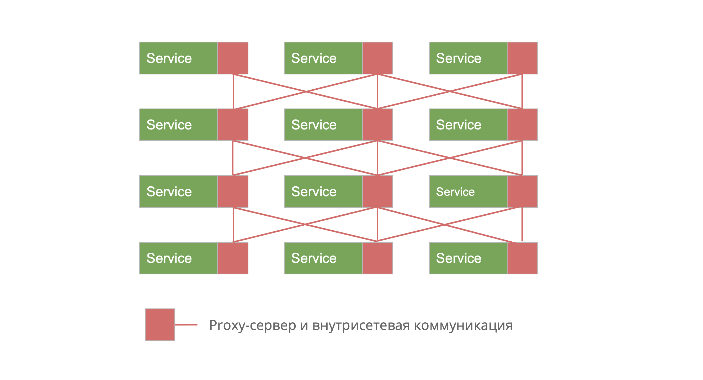
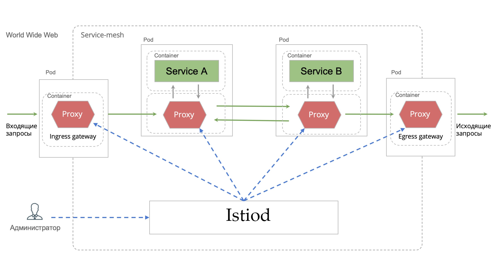
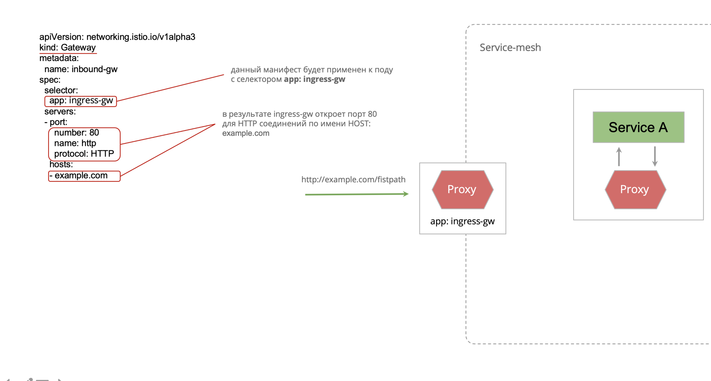
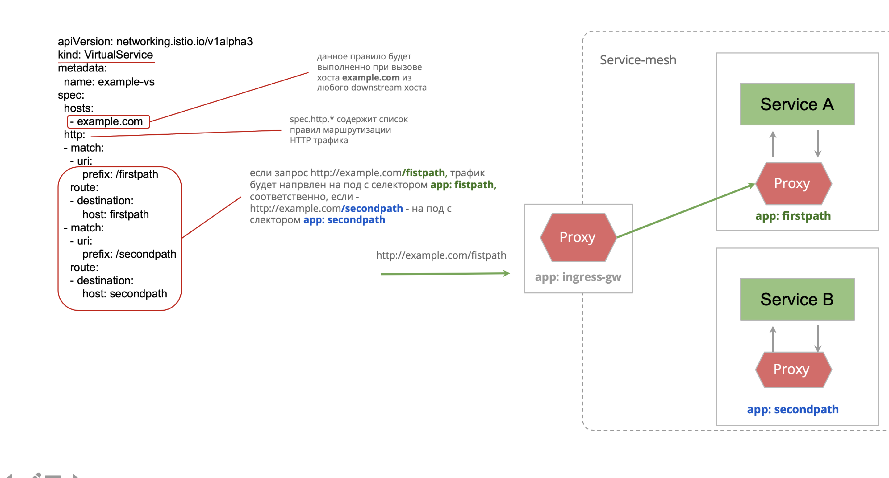
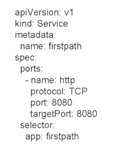
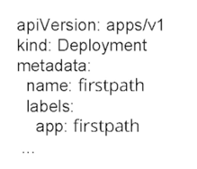
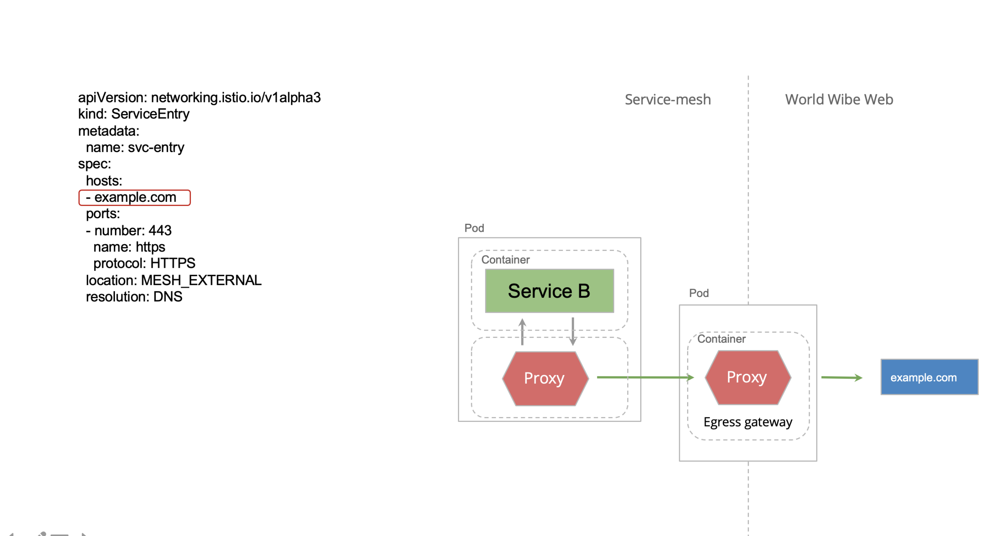
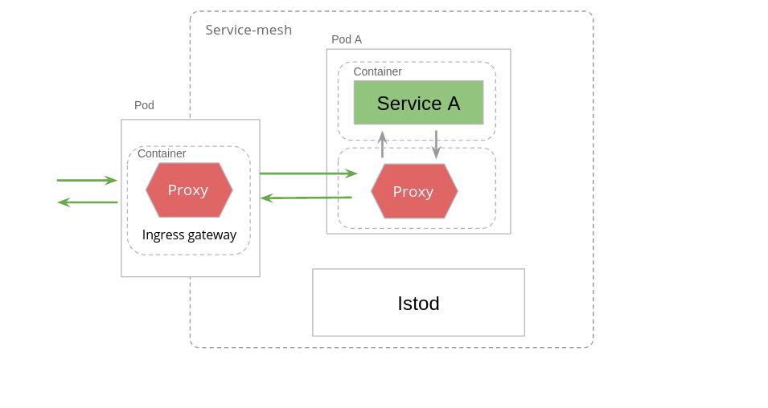
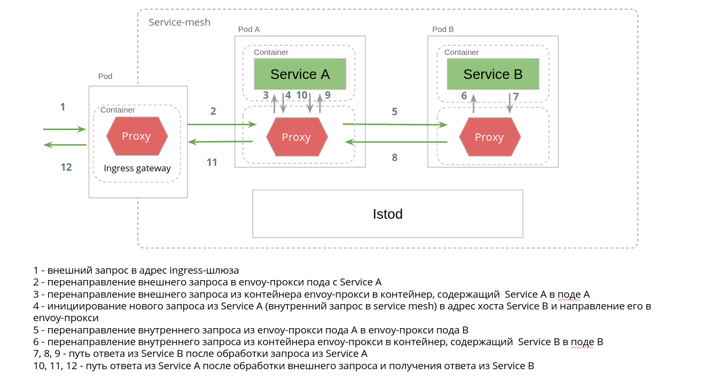
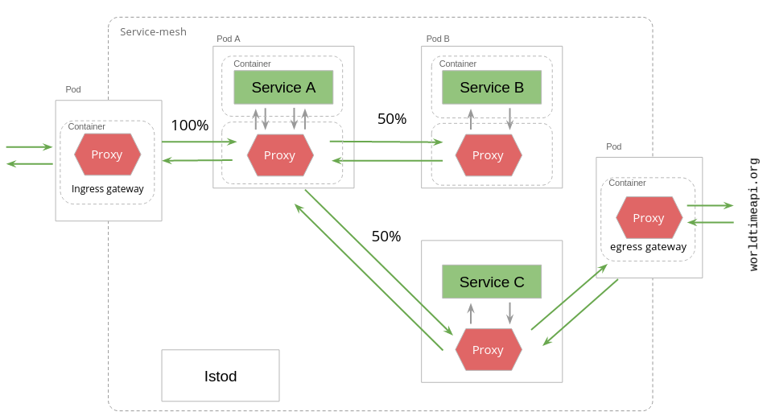

# Оглавление

# Service Mesh

Service Mesh - это выделенный инфраструктурный слой для обеспечения сетевых коммуникаций между сервисами с
использованием прокси.

Вызовы между сервисами перехватываются прокси-серверами,
работа которых координируется централизованной сетевой службой,
предоставляющей API для управления сетью и наблюдения за ней.

* Зелёные прямоугольники — бизнес-сервисы
* Красные квадраты — proxy-серверы, транспортирующие трафик
* Красные линии — внутрисетевые связи между proxy-серверами.

 

_**В каком количестве изолированных сетевых контуров происходит транспорт запросов и ответов в случае взаимодействия
внешних клиентов с сервисом внутри service mesh?**_

В Service Mesh при взаимодействии внешних клиентов с сервисами внутри кластера транспорт запросов и ответов обычно
проходит через три изолированных сетевых контура:

1. Внешний контур (Ingress)
   • Внешние клиенты отправляют запросы в кластер через Ingress Controller или API Gateway (например, Istio Ingress
   Gateway, Nginx, Envoy).
   • Этот уровень отвечает за аутентификацию, авторизацию, TLS-терминирование и маршрутизацию к нужному сервису.

2. Внутренний сервисный контур (Service-to-Service)
   • После попадания в кластер трафик маршрутизируется между подами через sidecar-прокси (например, Envoy в Istio).
   • В этом контуре обычно используется mTLS (Mutual TLS) для шифрования, а также политики маршрутизации и балансировки
   нагрузки.

3. Контур узла (Node Network)
   • Kubernetes использует CNI (Container Network Interface) плагины (например, Calico, Cilium, Flannel) для
   маршрутизации трафика между узлами кластера.
   • Здесь обеспечивается изолированность сетей, NAT, eBPF-фильтрация и возможное применение политики сетевой
   безопасности (NetworkPolicy).

🔹 Вывод: При взаимодействии внешних клиентов с сервисами внутри Service Mesh трафик проходит через три изолированных
сетевых контура:
1️⃣ Ingress (Внешний)
2️⃣ Service-to-Service (Внутренний сервисный)
3️⃣ Node Network (Узловой)

# Istio

*Управление трафиком*

* Автоматическая балансировка нагрузки.
* Контроль HTTP, gRPC, WebSocket и TCP-трафика через множество правил маршрутизации, повторов, аварийных переключений,
  лимитов запросов, внедрений неисправностей и др.
* Реализация различных стратегий развертывания сервисов.

*Безопасность на границе и внутри сети микросервисов*

* Обеспечение безопасности межсервисных коммуникаций посредством сквозной аутентификации и авторизации

*Наблюдаемость сети и real-time контроль*

* Сбор метрик, логирование и трассировка запросов внутри кластера

## Архитектура

Управляющие сервисы Istio в терминологии service mesh называются «control plane».
Control plane Istio представлен сервисом istiod (istio demon), который, так же как и другие сервисы, разворачивается в
service mesh.

Совокупность управляемых proxy-серверов — «data plane». Каждый proxy-сервер - это envoy-proxy sidecar контейнер.

### Gateway

Манифест Gateway конфигурирует изолированный envoy-proxy, который управляет
всем входящим (ingress-шлюз) или исходящим (egress-шлюз) трафиком сети.

Envoy-proxy представляет собой обратный прокси-сервер для HTTP и TCP-трафика.
Он принимает входящие запросы и направляет их на соответствующий вышестоящий сервис, а после того, как сервис
обрабатывает запрос и отправляет ответ, Envoy отправляет ответ обратно клиенту

#### Отличие от k8s Ingress

Позволяет иметь большую гибкость конфигураций трафика в отличие от API-объекта Kubernetes с именем Ingress. Gateway
определяет список портов, которые должны быть открыты, используемые протоколы соединения, SNI (Server Name Indication)
конфигурации aka "белые списки" сертификатов.

#### Пример

Ingress-шлюз с селектором ingress-gw, контролирующий весь входящий трафик в service mesh, откроет порт 80 для создания
HTTP-соединений с именем хоста example.com.

### VirtualService

Манифест VirtualService определяет список правил маршрутизации трафика внутри service-mesh в привязке к имени
вызываемого хоста.

Каждое правило содержит спецификации трафика, его источника, протокола соединения и пр., при совпадении которых
происходит выполнение правила — направление трафика на указанный сервис или на его отдельную версию

Чтобы это сработало, нужно зарегистрировать хост, а потом привязать его к Deployment.

Для этого создаём Service:

И указываем метку в Deployment:

### DestinationRule

Манифест DestinationRule определяет политики управляющие трафиком после выполнения маршрутизации:

* режим балансировки нагрузки на сервис назначения, в том числе на разные его версии
* размер пула соединений прокси-сервера сервиса назначения (host в VirtualService)
* признаки пода с нарушенной работоспособностью и параметры вывода его из балансировки (5xx ошибки, время вывода из
  балансировки ...)

### ServiceEntry

Настройка Egress трафика:

* направить трафик на сервисы вне service-mesh;
* Задать параметры соединений (retry, timeout и т. д.).

Во внутренний реестр сервисов Istio будет добавлен новый сервис со значением хоста example.com, что наряду с другими
конфигурациями egress-шлюза позволит Service B совершить исходящий запрос на внешний сервис

# Сценарии

# Ingres -> serviceA

## Маршрутизация входящего трафика в ServiceA

### 1. Создаём Service

[service.yaml](examples/ingress-serviceA/service.yaml)

### 2. Gateway

[gateway.yaml](examples/ingress-serviceA/gateway.yaml)

### 3. Правила маршрутизации

[vs.yaml](examples/ingress-serviceA/vs.yaml)

### Лог доступа

~~~bash
kubectl logs -l app=istio-ingressgateway -n istio-system -c istio-proxy
kubectl logs -l app=service-a-app -c istio-proxy
~~~

# Ingress -> serviceA -> serviceB

## Маршрутизация из ServiceA в ServiceB

### 1. Service для ServiceB

[service.yaml](examples/ingress-serviceA-serviceB/service.yaml)

### 2. Правила маршрутизации

[vs.yaml](examples/ingress-serviceA-serviceB/vs.yaml)

## Расщепление трафика из ServiceA по другим сервисам

### 1. Service для ServiceC

[service.yaml](examples/ingress-serviceA-serviceB/service.yaml)

### 2. Правила маршрутизации

[vs.yaml](examples/ingress-serviceA-serviceB/vs.yaml)

## Egress

Существует 3 подхода к открытию исходящего трафика в Istio:

1) Открытый доступ из любого пода на любой внешний хост по умолчанию - удобный подход для разработки, но не безопасный и
   не
   контролируемый, поэтому в промышленной эксплуатации применяется редко.

2) Отсутствие доступа на любой внешний хост исключая те, которые явно указаны в манифесте ServiceEntry.

3) Направление трафика на внешний хост через единый egress шлюз - позволяет обогатить весь исходящий трафик из кластера
   требуемой логикой (например обогатить заголовками для аутентификации запросов), мониторировать и контролировать его.
   Данный подход применяться в больших промышленных системах.

### 1. Gateway Egress

В соответствии с этим манифестом новое правило будет работать при вызовах на хост
`istio-ingressgateway.istio-system.svc.cluster.local` из шлюза `istio-egressgateway`, а также из любого envoy-прокси в
неймспейсе. 
Если вызов придёт из любого envoy-прокси в namespace (кроме istio-egressgateway), произойдет его
перенаправление на хост istio-egressgateway. 
Если поступит запрос из istio-egressgateway, то он будет направлен на хост
istio-ingressgateway.istio-system.svc.cluster.local. Таким образом достигается сосредоточение всех исходящих вызовов в
кластере на шлюз istio-egressgateway.

Теперь исходящий трафик направляется через egress-шлюз и достигает `istio-ingressgateway.istio-system.svc.cluster.local`

*То есть ServiceC обращается к http://istio-ingressgateway.istio-system.svc.cluster.local/service-ext*

# Полезные команды

## Адрес по которому можно совершить запрос в ingress-шлюз

~~~bash
# host
kubectl -n istio-system get service istio-ingressgateway -o jsonpath='{.status.loadBalancer.ingress[0].ip}'
# port
kubectl -n istio-system get service istio-ingressgateway -o jsonpath='{.spec.ports[?(@.name=="http2")].port}'
~~~

