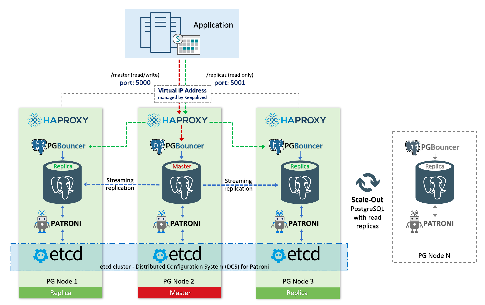
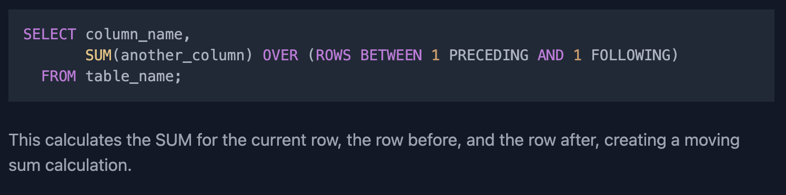
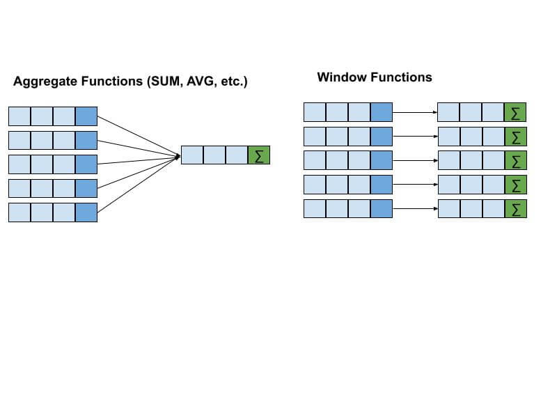
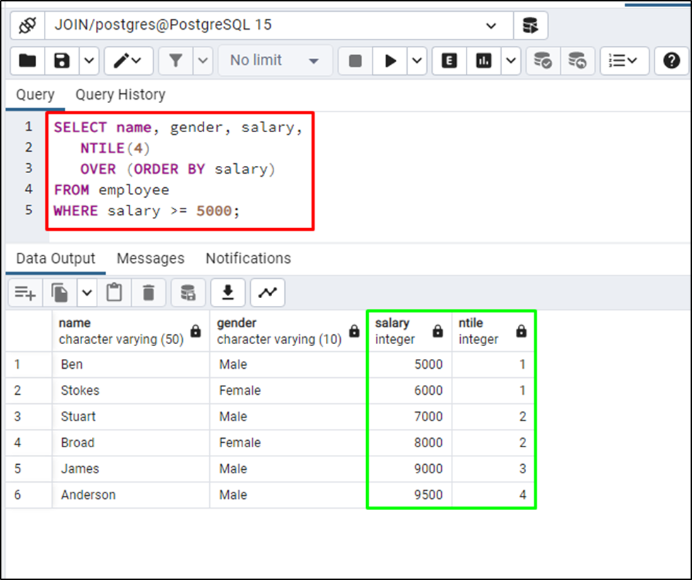
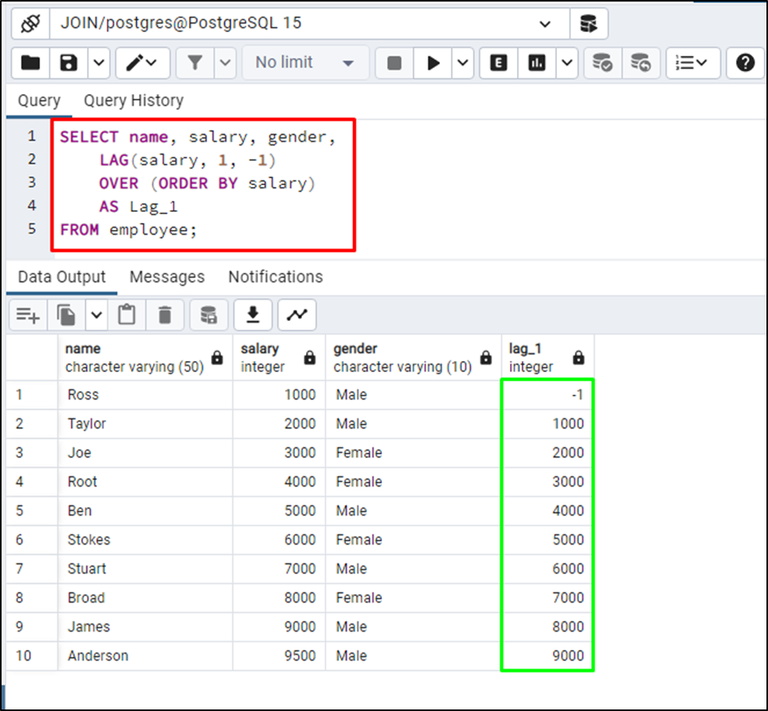
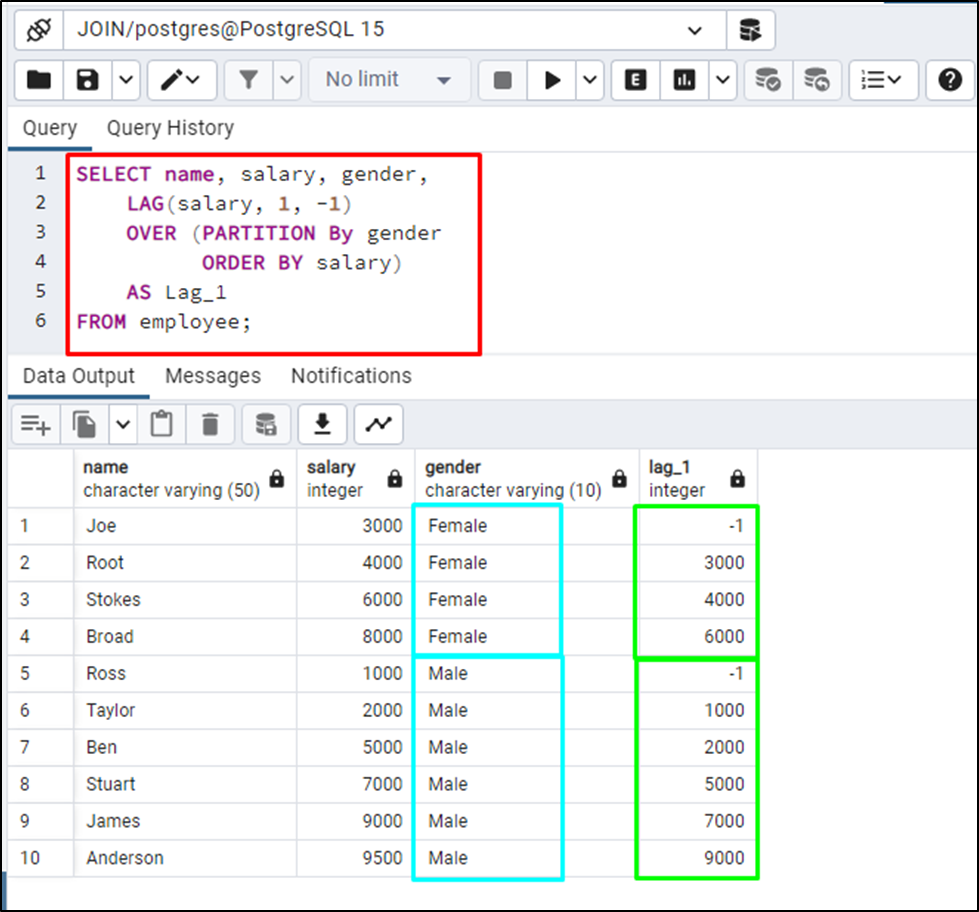

# Patroni

[Создание кластера Patroni](https://www.linode.com/docs/guides/create-a-highly-available-postgresql-cluster-using-patroni-and-haproxy/)

# SQL

## Фичи

### Coalesce

The COALESCE() function accepts a list of arguments and returns the first non-null argument.

~~~postgresql
SELECT coalesce(
               ROUND(cnt * 1.0 / all_cnt, 2),
               0) 
~~~
Если ROUND вернёт NULL, то он заменится на 0.

### CASE WHEN

~~~sql
select sum(
               case
                   when student_id is not NULL
                       THEN 1
                   ELSE 0
                   END)
           as attended_exams
~~~

### CTE

Use only at PostgreSQL 12+

[PostgreSQL 11 issue](https://hakibenita.com/be-careful-with-cte-in-postgre-sql)

~~~postgresql
WITH cte_products_wt_dates AS (SELECT product_id,
                                      MAX(change_date) as change_date
                               FROM Products
                               WHERE change_date <= '2019-08-17'
                               GROUP BY product_id),
     cte_default_prices AS (SELECT DISTINCT product_id,
                                            10 as price
                            FROM Products)
~~~

## Оконные функции

~~~sql
SELECT {columns}, 
       {window_func} OVER (
                    PARTITION BY {partition_key} 
                    ORDER BY {order_key}
                                       ROWS BETWEEN/ RANGE BETWEEN
                )
FROM table1;
~~~

### ROWS BETWEEN

While `PARTITION BY` divides the dataset into groups for separate calculations, while the `ROWS BETWEEN` clause enables
calculations over a moving window of rows that adjusts based on the position of the current row.

1. Все, что до текущей строки/диапазона и само значение текущей строки

   `BETWEEN UNBOUNDED PRECEDING`

   `BETWEEN UNBOUNDED PRECEDING AND CURRENT ROW`
2. Текущая строка/диапазон и все, что после нее

   `BETWEEN CURRENT ROW AND UNBOUNDED FOLLOWING`
3. С конкретным указанием сколько строк до и после включать (не поддерживается для RANGE)

   `BETWEEN N Preceding AND N Following`

   `BETWEEN CURRENT ROW AND N Following`

   `BETWEEN N Preceding AND CURRENT ROW`

### Aggregate vs window functions

Оконные функции, как и агрегатные функции, работают с множеством строк, называемым рамкой окна.
В отличие от агрегатных функций, оконные функции возвращают единственное значение для каждой строки рассматриваемого
запроса.

Окно определяется с использованием предложения OVER(). Оно позволяет задать окно на основе конкретного столбца, подобно
GROUP BY в случае агрегатных функций.
Вы можете использовать агрегатные функции с оконными функциями, но вам нужно будет использовать их с предложением
OVER().

### Functions

| Function      | Explanation                                                                                                                                                 | 
|---------------|-------------------------------------------------------------------------------------------------------------------------------------------------------------|
| Ранжирование  |                                                                                                                                                             |
| ROW_NUMBER()  | Assigns a unique sequential integer to each row within the partition.                                                                                       | 
| RANK()        | Также нумирует строки. В отличии от ROW_NUMBER строкам с одинаковыми значениям присваивает тот же номер. При этом сам номер продолжит расти автоинкрементом | 
| DENSE_RANK()  | Тоже самое что и RANK, только продолжает нумерацию                                                                                                          | 
| NTILE()       | Распределить что-то по группам                                                                                                                              | 
| Аналитические | Вычисляют значения на базе движущегося окна строк                                                                                                           | 
| LAG()         | Значение выражения, вычисленного для предыдущей строки. Если строки не существует - используется NULL. Можно поменять, с помощью 3го параметра              | 
| LEAD()        | Значение выражения, вычисленного для следующей строки. Если строки не существует - используется NULL. Можно поменять, с помощью 3го параметра               | 
| FIRST_VALUE() | Возвращает первое из упорядоченного набора значений                                                                                                         | 
| LAST_VALUE()  | Возвращает последнее из упорядоченного набора значений                                                                                                      | 

#### Rank vs Dense_rank

Rank:

~~~
1	1
5	2
6	3
6	3
6	3
13	6
~~~

Dense_Rank:

~~~
1	1
5	2
6	3
6	3
6	3
13	4
~~~

#### NTILE

#### LAG и LEAD

Просто берёт предыдущую строку:

Добавим различение по группам в виде гендера

### Rolling Sum

~~~sql
SELECT person_name,
       SUM(weight) OVER (
           ORDER BY turn
           ROWS BETWEEN UNBOUNDED PRECEDING AND CURRENT ROW) as rolling_sum
FROM Queue
~~~

~~~
| person_name | weight | rolling_sum |
| ----------- | ------ | ----------- |
| Alice       | 250    | 250         |
| Alex        | 350    | 600         |
| John Cena   | 400    | 1000        |
| Marie       | 200    | 1200        |
| Bob         | 175    | 1375        |
| Winston     | 500    | 1875        |
~~~