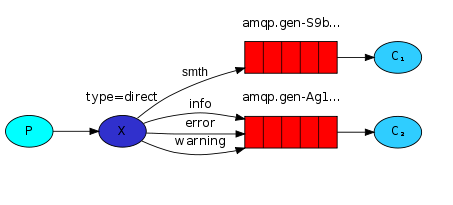
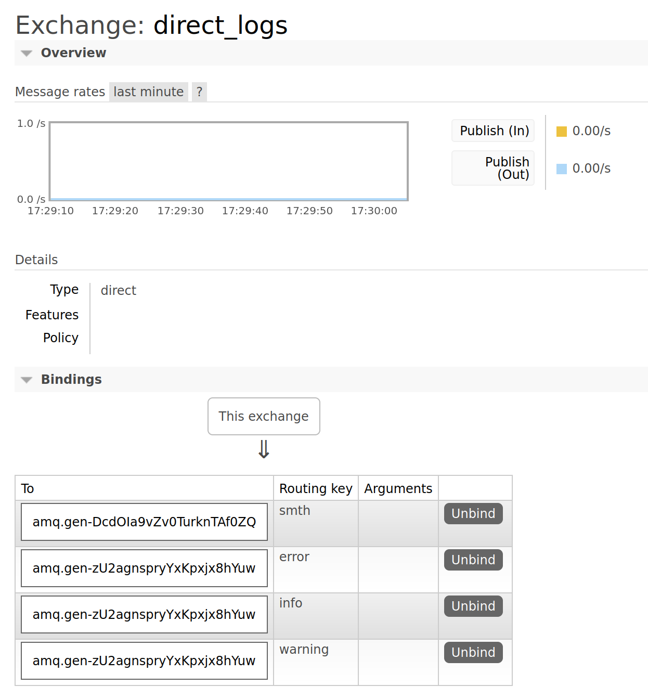

## Direct Exchange

Producer всё также не общается с очередью напрямую, а ходит через exchange.
При данном типе публикации - необходимо явно указывать routing key, 
который должна bind-ть созданная consumer-м очередь.

### Test

Создаём две очереди, в рамках одного exchange
~~~bash
python3 consumer.py info warning error
python3 consumer.py smth
~~~

Producer отправляет сообщения
~~~
python3 producer.py  error "Run. Run. Or it will explode."
python3 producer.py smth "Test direct exchange"
~~~