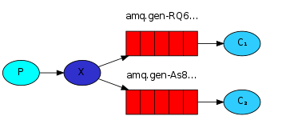
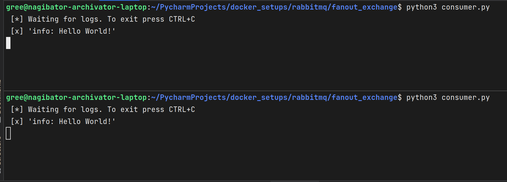

## Fanout Exchange

Все сообщения доставляются во все очереди, даже если в сообщении задан ключ маршрутизации.

Особенности:

- RabbitMQ не работает с ключами маршрутизации и шаблонами что положительно влияет на производительность. Это **самый
  быстрый** exchange;
- все потребители должны иметь возможность обрабатывать все сообщения;

Producer, отправив сообщение в exchange, автоматически отправляет его во все очереди:

