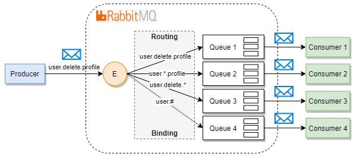

# Topic Exchange

Topic exchange – аналогично direct exchange дает возможность осуществления выборочной маршрутизации путем сравнения ключа маршрутизации. Но, в данном случае, ключ задается по шаблону. При создании шаблона используются 0 или более слов (буквы AZ и az и цифры 0-9), разделенных точкой, а также символы * и #.

    * — может быть заменен на ровно 1 слово
    # — может быть заменен на 0 или более слов

Графическое представление потока сообщений:

Особенности:

- применение этого обменника может стать хорошим выбором для возможного будущего развития приложения, т.к. шаблоны всегда можно настроить так, чтобы сообщение публиковалось аналогично direct exchange или fanout exchange
- шаблоны, которые используют * намного быстрее, чем шаблоны, которые используют #.
- topic exchange **медленнее** direct exchange

## Test

Поднимаем очередь которая будет bind-ть сообщения с routing key шаблоном "*.critical"
~~~~
python3 consumer.py "*.critical"
~~~~

Publisher:
~~~
python3 producer.py "test.critical" "message info"
~~~