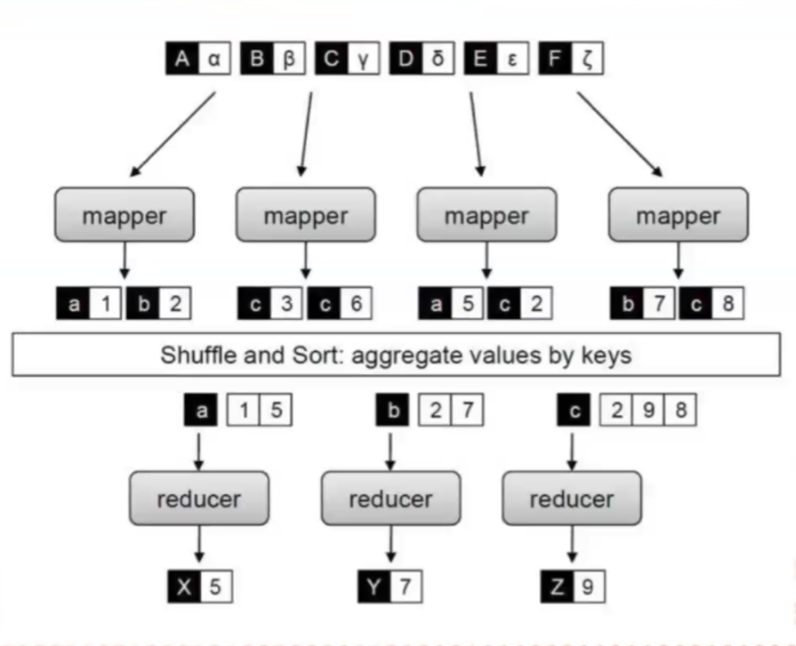
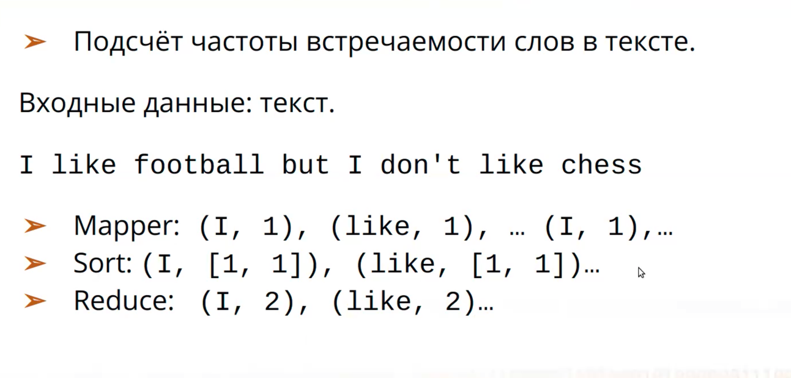
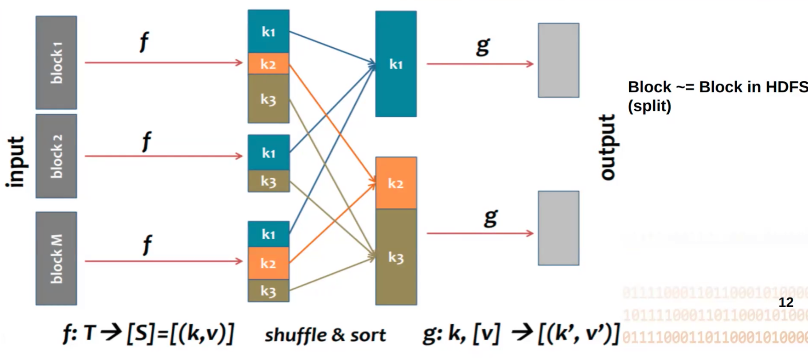
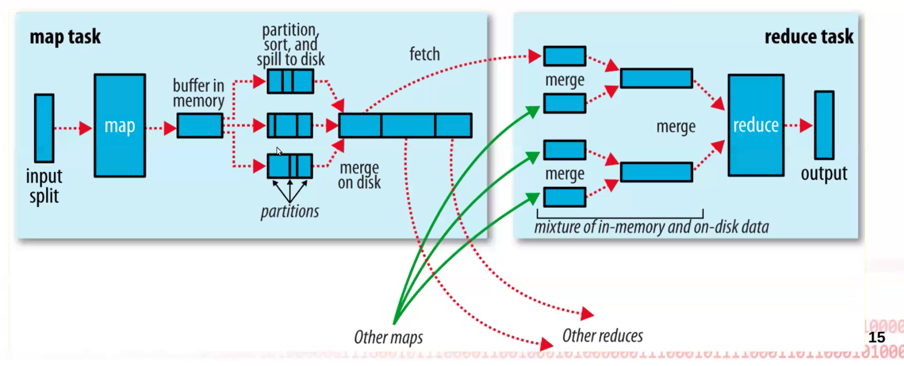
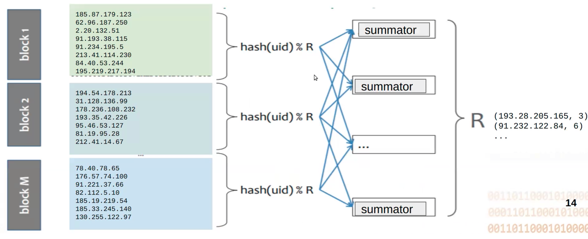
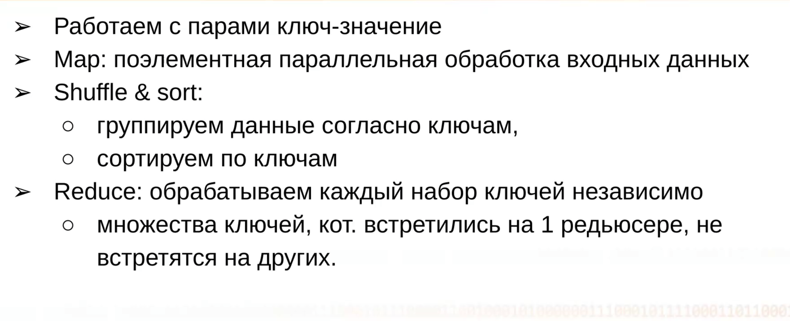
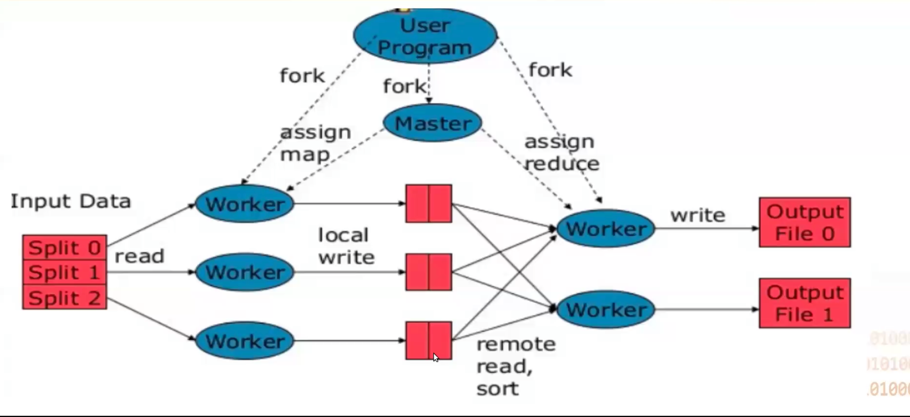
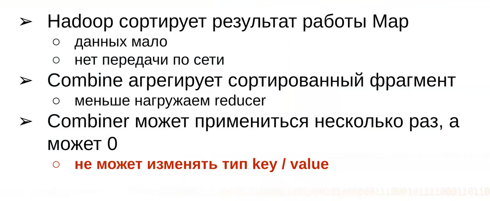
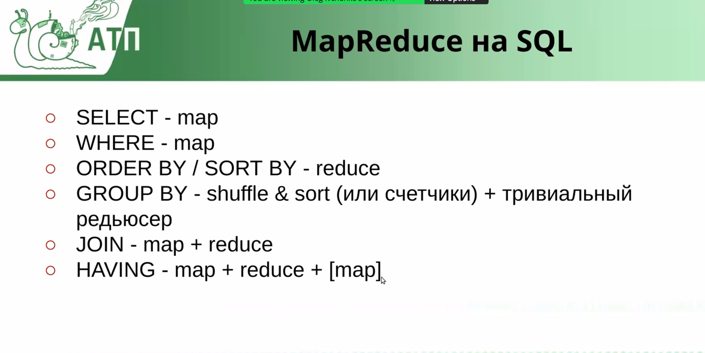

### MapReduce

Стадии MapReduce:

1. **MAP**: Берём пары ключ, значение [(k1, v1), (k2, v2), ...] и независимо их обрабатываем
2. **SORT**: группировка по ключам k и сортировка
3. **REDUCE**: с этими группами проводим агрегацию и тд.

Пример:

~~~python
>> > reduce(lambda x, y: x + y, range(5))
>> > 10  # sum 0 to 4
~~~

Hadoop - код к данным. Данные уже где-то есть и как-то разбиты:

* f - map
* g - reduce

Буфер лежит в ОЗУ и когда он переполнился - сбрасывается на диск. (Так происходит много раз)
После сброса происходит разбиение этих маленьких файлов на группы(partitioning).
Далее они сливаются в файл побольше с сохранением ранее размеченных групп.
К группам применяется hash и по результатам функции уже распределяем группы на reducer-ы.

**На mapper-е мы ничего в ОЗУ не храним, так как памяти даже на выход в буфер может не хватить**

Если нужно мини объединение - используем combiner

