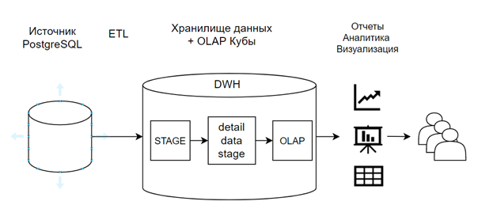
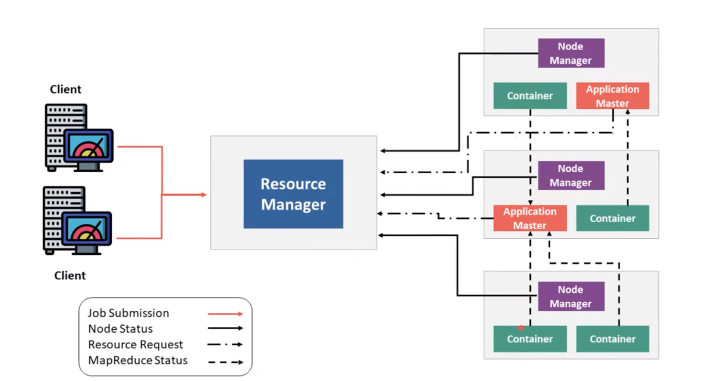
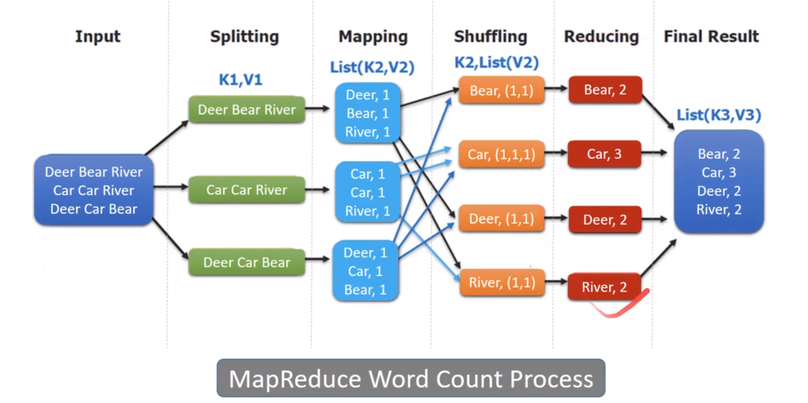

## Installation

docker images

~~~bash
docker pull itayb/spark:3.1.1-hadoop-3.2.0-aws
docker pull itayb/jupyter-notebook:6.2.0-spark-3.1.1-java-11-hadoop-3.2.0
~~~

## Конспекты:

### DWH

**DWH**(Data WareHouse) - хранилище разных данных, которые уже отсортированы и преобразованы.

Выполняются следующие операции с данными:

* Извлечение самих данных – вся информация от источников переходит в отдельную Базу данных и приводится к единому
  формату
* Преобразование данных – информация подготавливается для хранения в оптимальной форме
* Загрузка и обновление данных – данные помещаются в хранилище
* Анализ данных
* Результаты анализа данных

Грубо говоря - данные приводятся к какой-то модели

### Data Lake

**Data Lake** - хранилище, где хранятся все необработанные данные в исходном формате без преобразования. Каждый элемент
в Data Lake обозначен уникальным идентификатором и набором тегов метаданных. Данные могут быть неструктурированными,
полуструктурированными
или структурированными, они преобразуются только при запросе на использование.

Оба подхода используют разные процессы для управления данными. Data Warehouse использует метод *ETL* – Extract,
Transform
и Load. В свою очередь, Data Lake использует *ELT* — Extract, Load и Transform.

### ETL и ELT

*ETL* использует промежуточный сервер для преобразования данных и только потом загружает их в хранилище Data Warehouse.
Такой подход применяется для небольшого количества данных и вычислительных преобразований.

*ELT* работает с большими объемами данных и сразу грузит их в Базу данных, их преобразование происходит уже в целевой
системе. Скорость загрузки данных никогда не зависит от их размера. Из минусов, ELT сложнее внедрить в систему в отличие
от ETL, так как для внедрения и поддержки ELT требуются нишевые знания.

### Сервисы Hadoop

#### Yarn
*Yarn* - resource manager, управляет запуском контейнеров, в которых уже и работают spark приложения

Приходит задача на запуск приложения. Resource manager поднимает первый контейнер - Application master.
В нём запускается первый instance приложения, который идёт к resource manager-у и запрашивает уже ресурсы на исполнение.
Например - ещё 3 контейнера. Тот опрашивает node manager-ы в поисках свободных ресурсов.
Application master получив список нод обращается к node manager-м уже за ресурсами и там тоже запускаются экземпляры
нашего приложения.

Note:
spark executor запускается в yarn контейнере, а application master контейнер уже содержит драйвер - своего рода
контроллер.
yarn executor - это дочерний процесс.

Разделение ресурсов происходит по очередям. Каждое приложение попадает в свою очередь.

#### Apache Oozie
*Apache Oozie* — это планировщик рабочих процессов для Hadoop. Это система, которая запускает рабочий процесс зависимых
заданий. Здесь пользователям разрешается создавать направленные циклические графы рабочих процессов, которые можно
запускать параллельно и последовательно в Hadoop. Оркестратор, в котором через xml описывается pipeline

#### MapReduce

#### ZooKeeper
*ZooKeeper* - каталог информации о кластере для сервисов

### HDFS - проблема мелких файлов

Namenode, которая содержит информацию о расположении всех файлов, хранится в ОЗУ.
Рассмотрим в качестве примера файл в 10мб.
Его можно хранить как:

~~~
blck_1 10 mb
~~~

или:

~~~
blck_1 1 mb
...
black_10 1 mb
~~~

Второй способ плох, так как namenode хранит данные в ОЗУ, а хранение 1й записи дешевле 10и.

**Рекомендуемый размер блока в HDFS - 128 мб**
