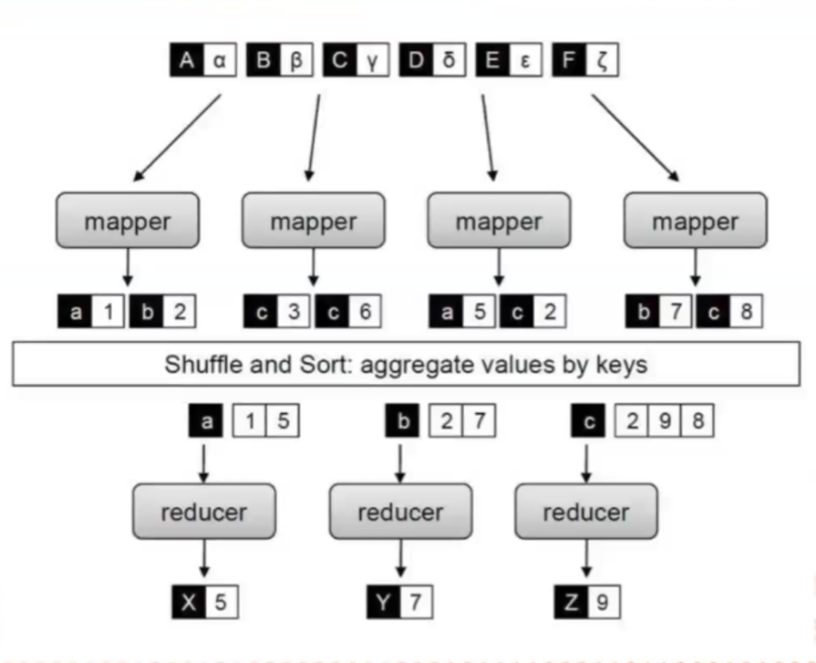
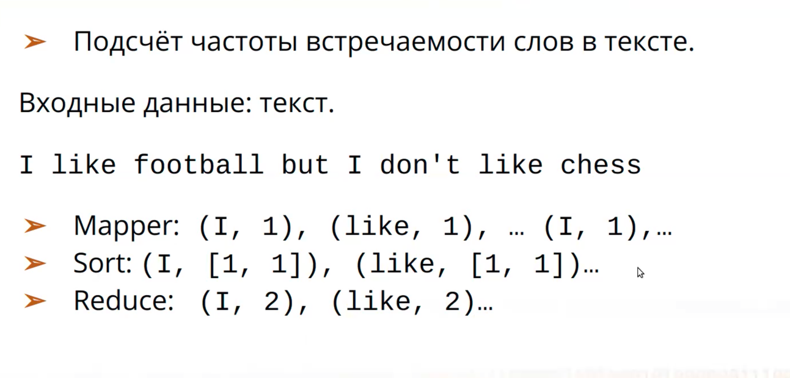
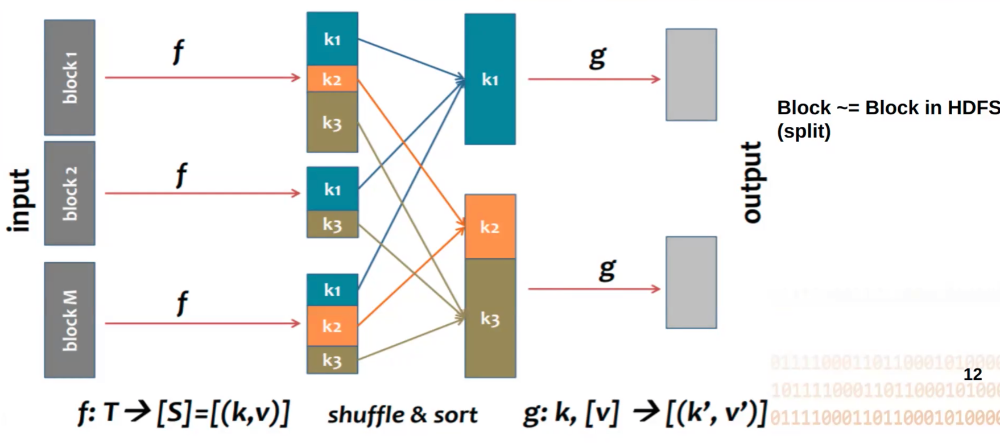
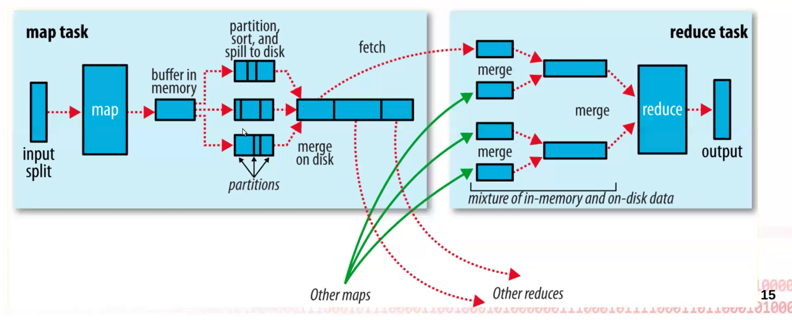
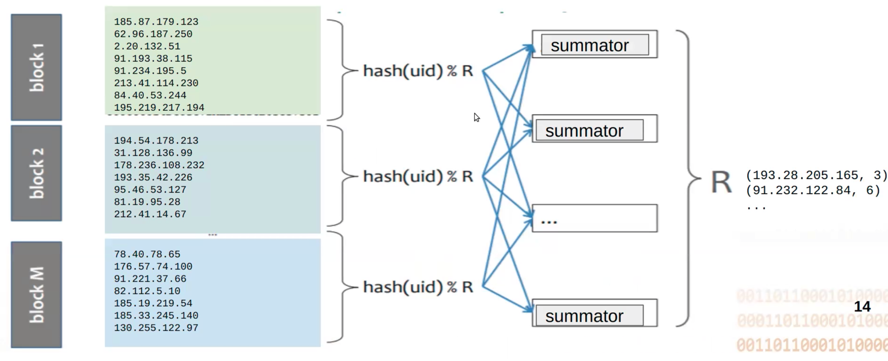
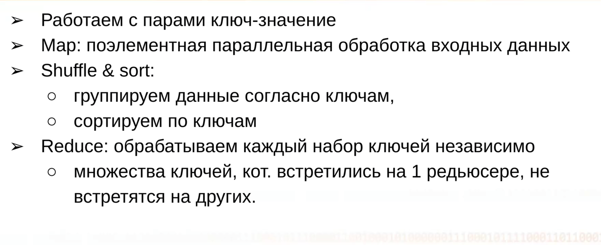
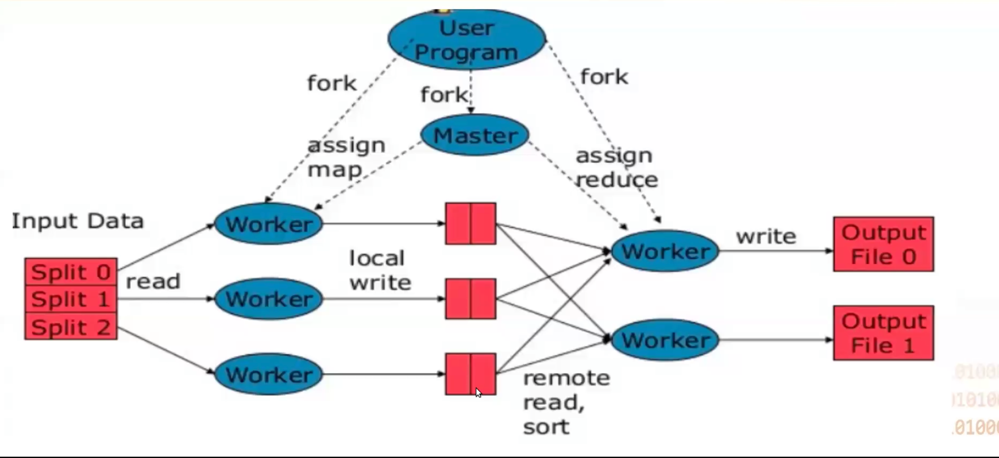

# O big data

## что такое big data

  

* Volume - даннных больше чем можно поместить на одном сервере
* Variety - данные неструктурированны и приходят разных источников
* Velocity - как обрабатываются данные: батч обработка, realtime..

### DWH

**DWH**(Data WareHouse) - хранилище разных данных, которые уже отсортированы и преобразованы.

Выполняются следующие операции с данными:

* Извлечение самих данных – вся информация от источников переходит в отдельную Базу данных и приводится к единому
  формату
* Преобразование данных – информация подготавливается для хранения в оптимальной форме
* Загрузка и обновление данных – данные помещаются в хранилище
* Анализ данных
* Результаты анализа данных

Грубо говоря - данные приводятся к какой-то модели

### Data Lake

**Data Lake** - хранилище, где хранятся все необработанные данные в исходном формате без преобразования. Каждый элемент
в Data Lake обозначен уникальным идентификатором и набором тегов метаданных. Данные могут быть неструктурированными,
полуструктурированными
или структурированными, они преобразуются только при запросе на использование.

Оба подхода используют разные процессы для управления данными. Data Warehouse использует метод *ETL* – Extract,
Transform
и Load. В свою очередь, Data Lake использует *ELT* — Extract, Load и Transform.

### ETL и ELT

*ETL* использует промежуточный сервер для преобразования данных и только потом загружает их в хранилище Data Warehouse.
Такой подход применяется для небольшого количества данных и вычислительных преобразований.

*ELT* работает с большими объемами данных и сразу грузит их в Базу данных, их преобразование происходит уже в целевой
системе. Скорость загрузки данных никогда не зависит от их размера. Из минусов, ELT сложнее внедрить в систему в отличие
от ETL, так как для внедрения и поддержки ELT требуются нишевые знания.

### MapReduce

Стадии MapReduce:

1. **MAP**: Берём пары ключ, значение [(k1, v1), (k2, v2), ...] и независимо их обрабатываем
2. **SORT**: группировка по ключам k и сортировка
3. **REDUCE**: с этими группами проводим агрегацию и тд. 

Пример:
~~~python
>>> reduce(lambda x,y: x+y, range(5))
>>> 10  # sum 0 to 4
~~~

Hadoop - код к данным. Данные уже где-то есть и как-то разбиты:

* f -  map
* g - reduce

Буфер лежит в ОЗУ и когда он переполнился - сбрасывается на диск. (Так происходит много раз)
После сброса происходит разбиение этих маленьких файлов на группы(partitioning). 
Далее они сливаются в файл побольше с сохранением ранее размеченных групп. 
К группам применяется hash и по результатам функции уже распределяем группы на  reducer-ы. 

