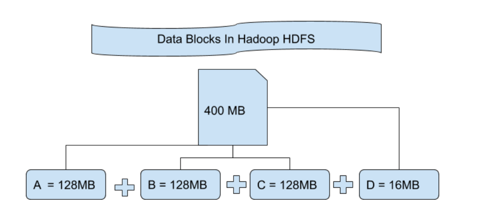

блоки hdfs, разделы, проблема малеьких файлов

## Как Hadoop хрнаит файлы

What happens is whenever you import any file to your Hadoop Distributed File System that file got divided into blocks of
some size and then these blocks of data are stored in various slave nodes. This is a kind of normal thing that happens
in almost all types of file systems. By default in Hadoop1, these blocks are 64MB in size, and in Hadoop2 these blocks
are 128MB in size which means all the blocks that are obtained after dividing a file should be 64MB or 128MB in size.
You can manually change the size of the file block in hdfs-site.xml file.

Suppose you have uploaded a file of 400MB to your HDFS then what happens is, this file got divided into blocks of
128MB + 128MB + 128MB + 16MB = 400MB size. Means 4 blocks are created each of 128MB except the last o

## Input splits

Hadoop uses a process called InputFormat to perform input splits. InputFormat is an abstract class in Hadoop, which
defines the input specifications for a MapReduce job. It specifies the input data source, how the data should be read,
and how it should be split into input splits.

InputFormat uses the following three factors to determine input splits:

* **File size:** The InputFormat class considers the size of the input file when dividing it into input splits. By
  default, Hadoop uses a block size of 128 MB, which means that files larger than 128 MB are divided into multiple input
  splits.

* **Compression:** InputFormat also takes into account the compression used for the input data. If the input data is
  compressed, it needs to be decompressed before it can be processed. Therefore, the InputFormat class creates input
  splits that are large enough to contain the uncompressed data.

* **Input format:** InputFormat considers the type of input data source when dividing it into input splits. For example,
  if the input data source is a database, InputFormat may use the primary key of the database table to divide the data
  into input splits.

In general, if you have n nodes, the HDFS will distribute the file over all these n nodes. If you start a job, there
will be n mappers by default. Thanks to Hadoop, the mapper on a machine will process the part of the data that is stored
on this node.
Because of replication, there are multiple such nodes hosting the same block.

In case the nodes are not available, Hadoop will try to pick a node that is closest to the node that hosts the data
block. It could pick another node in the same rac

### HDFS - проблема мелких файлов

Namenode, которая содержит информацию о расположении всех файлов, хранится в ОЗУ.
Рассмотрим в качестве примера файл в 10мб.
Его можно хранить как:

~~~
blck_1 10 mb
~~~

или:

~~~
blck_1 1 mb
...
black_10 1 mb
~~~

Второй способ плох, так как namenode хранит данные в ОЗУ, а хранение 1й записи дешевле 10и.

**Рекомендуемый размер блока в HDFS - 128 мб**
