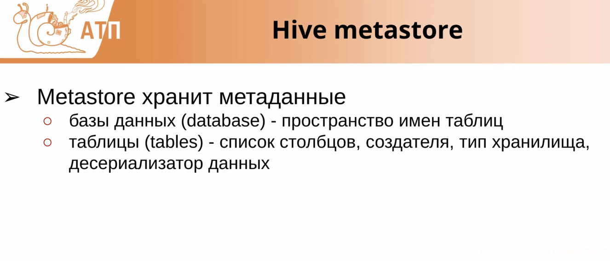

HIVE  - это интерфейс для работы с данными и механизмом взаимодействия с ними, 
так как хрнанилище он не реализует, а использует HDFS

# CLUSTERED BY AND PARTITIONED BY ??

# LIMIT vs TABLESAMPLE
https://bigdataschool.ru/blog/limit-vs-tablesample-in-spark-sql.html?ysclid=ll3y15021l5188159

MAP join???