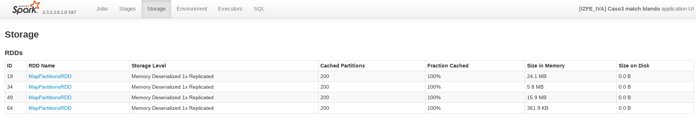
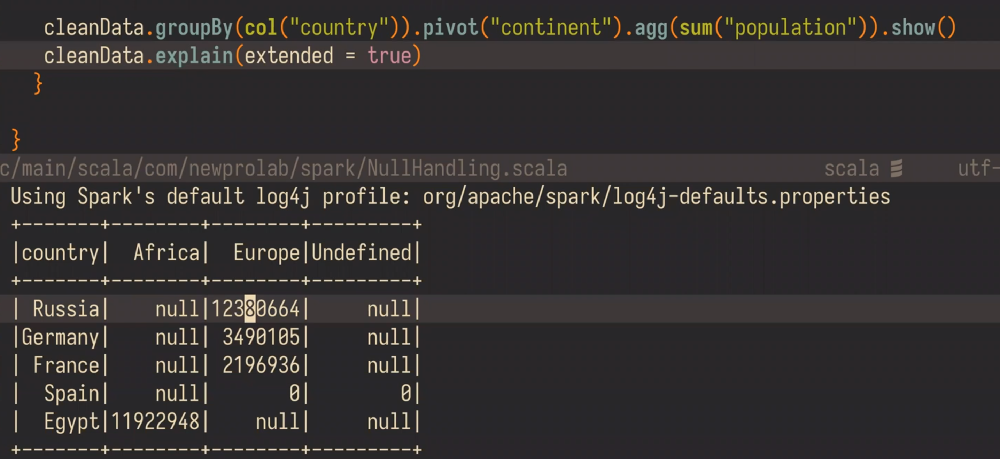
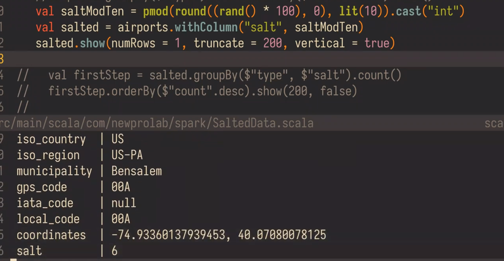
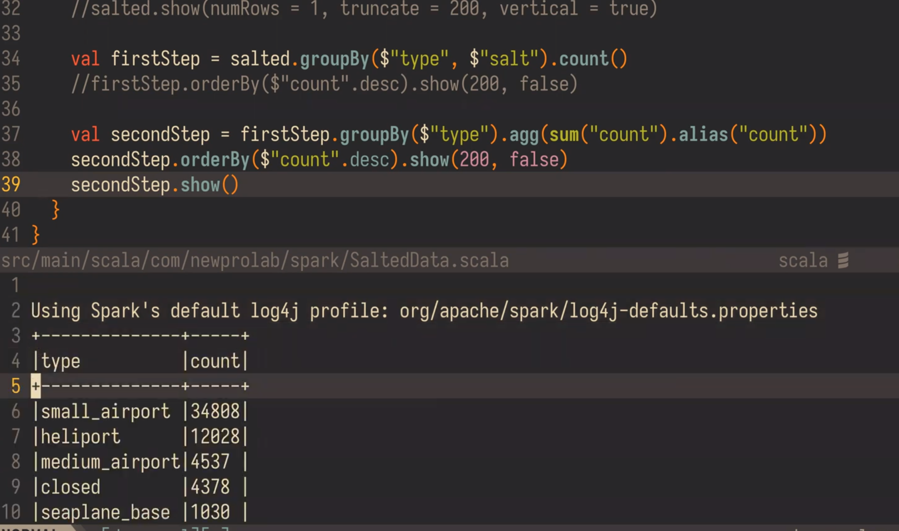

## MAP and FLATMAP

~~~scala
scala> val fruits = Seq("apple", "banana", "orange")
fruits: Seq[java.lang.String] = List(apple, banana, orange)

scala> fruits.map(_.toUpperCase)
res0: Seq[java.lang.String] = List(APPLE, BANANA, ORANGE)

scala> fruits.flatMap(_.toUpperCase)
res1: Seq[Char] = List(A, P, P, L, E, B, A, N, A, N, A, O, R, A, N, G, E)
~~~

## reduceByKey

~~~scala
  val data = Seq(("Project", 1),
  ("Gutenberg’s", 1),
  ("Alice’s", 1),
  ("Adventures", 1),
  ("in", 1),
  ("Wonderland", 1),
  ("Project", 1),
  ("Gutenberg’s", 1),
  ("Adventures", 1),
  ("in", 1),
  ("Wonderland", 1),
  ("Project", 1),
  ("Gutenberg’s", 1))
   
  val rdd=spark.sparkContext.parallelize(data)
~~~

~~~scala
  val rdd2=rdd.reduceByKey(_ + _) # проссуммировать значения по ключу
  rdd2.collect().foreach(println) # for(p <- rdd2.collect()) println(p)
~~~

### Example: количество встречаемых букв в словах

~~~scala
val cities = Vector("Moscow", "Omsk", "Kaliningrad")
val rdd = sc.parallelize(cities)

rdd.flatMap(x => x.toLowerCase) # Разбили по буквам и привели к нижнему
.map(x => (x, 1)) # Шаг Mapping
.reduceByKey(_ + _)
.collect()
.foreach(println)
~~~

~~~
(d,1)
(n,2)
(r,1)
(l,1)
(w,1)
(s,2)
(a,2)
(i,2)
(k,2)
(o,3)
(g,1)
(m,2)
(c,1)
~~~

# Spark

## Broadcast

В Spark RDD и DataFrame broadcast переменные — это общие переменные только для чтения, которые кэшируются и
доступны на всех узлах в кластере для доступа или использования задачами. Вместо того, чтобы отправлять эти данные
вместе с каждой задачей, spark распределяет широковещательные переменные на машине, используя эффективные алгоритмы
широковещательной рассылки для снижения затрат на связь.

Позвольте мне объяснить на примере, предположим, что вы получаете двухбуквенный код штата в файле и хотите преобразовать
его в полное название штата (например, CA to California, NY to New York и т. д.), выполнив поиск по
ссылочному отображению. В некоторых случаях эти данные могут быть большими, и у вас может быть много таких запросов.

Вместо того, чтобы распространять эту информацию вместе с каждой задачей по сети (накладные расходы и затраты времени),
мы можем использовать широковещательную переменную для кэширования этой информации поиска на каждой машине, и задачи
используют эту кэшированную информацию при выполнении преобразований.

## Broadcast vs localCheckpoint

LocalCheckpoint из Spark UI.

* local checkpointing writes data in executors storage
* regular checkpointing writes data in HDFS

localCheckpoint хранит ваши данные в хранилище исполнителей (как показано на скриншоте). Это полезно для
усечения графа происхождения RDD, однако в случае сбоя узла вы потеряете данные, и вам нужно будет пересчитать их (в
зависимости от вашего приложения вам, возможно, придется заплатить высокую цену).
«Стандартная» контрольная точка (Broadcast) хранит данные в надежной файловой системе (например, hdfs).
Это дороже в исполнении, но вам не нужно будет пересчитывать данные даже в случае сбоев.

## Implicits

~~~scala
import spark.implicits._
~~~

Конвертирует $"col name" в [[Column]]

Example:

~~~scala
df.filter($"value" === "Moscow")

# === для формирования условия, на основе которого можно получить выборку дальше:
# возвращает Column
~~~

$ <=> col()

## Pivot

Значения становятся колонками, а колонки значениями - выворачиваем таблицу.

## Солёный group by

Иногда невозможно уместить данные пратиции на worker. Решение - "солёный" group by.

Добавляем атрибут соль:

Делаем группировку по двум атрибутам: тип аэропорта и соль.
Таким образом получим более равномерно распределённые данные.

Далее делаем ещё один group by, но уже по type.

Тот же результат что и при стандартном, но на больших данных будет гораздо быстрее.

## Cache persist

*Применение:*
например, от какого исходного df идут сразу 2 разные ветки расчётов. Выгоднее закэшировать стартовый df и применять
преобразования уже к нему.

**Cache - это трансформация!**

Checkpoint укорачивает план запроса.