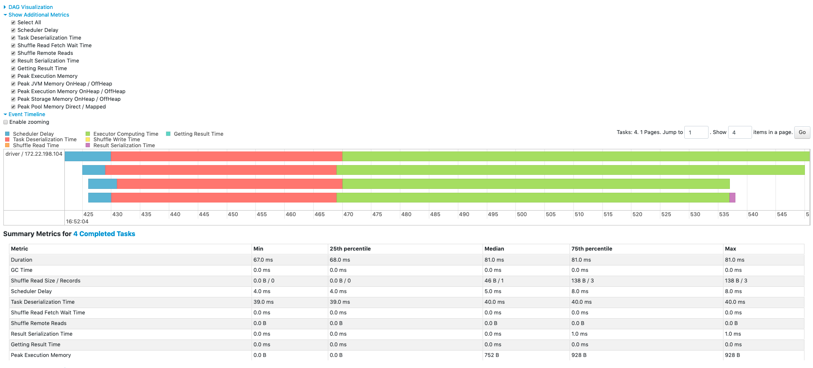

# Термины

* Все приложение - application
* От чтения данных до action - job-а.
* Stage - часть job-ы между shuffle.
* Task - часть stage для одной партиции.

Итак: Task << Stage << Job << Aplication.

## RDD

В RDD кусок данных называется партицией и каждая партиция хранится на своей ноде.
Свойства:

* Восстанавливаемость: сть возможность повторить граф вычислений от исходника.
* Итерируемость: между партициями ест связи
* Неизменяемость: применение действия создаёт новый rdd

### Неленивые трансформации

sortby, некоторые join. На выходе тоже rdd, но действие выполняется.

### Shuffle

Shuffle - это hadoop shuffle n sort. Сортировка, группировка

Часть трансформаций (map, flatmap, ...) обрабатывает партиции независимо. Такие трансформации называются narrow. reduce,
sortdBy аггрегируют данные и используют передачу по сети(выполняют shuffle). Они называются wide.
Wide-трансформации могут менять кол-во партиций.По wide-трансформациям происходит деление job'ы на Stages.

### Map vs flatmap

~~~scala
scala> val fruits = Seq("apple", "banana", "orange")
fruits: Seq[java.lang.String] = List(apple, banana, orange)

scala> fruits.map(_.toUpperCase)
res0: Seq[java.lang.String] = List(APPLE, BANANA, ORANGE)

scala> fruits.flatMap(_.toUpperCase)
res1: Seq[Char] = List(A, P, P, L, E, B, A, N, A, N, A, O, R, A, N, G, E)
~~~

Wordcount
Пусть даны следующие данные:

~~~text
=====	ЯВЛЕНИЕ 1
Лизанька	Светает!.. Ах! как скоро ночь минула!
Лизанька	Вчера просилась спать - отказ,
Лизанька	"Ждем друга". - Нужен глаз да глаз,
Лизанька	Не спи, покудова не скатишься со стула.
Лизанька	Теперь вот только что вздремнула,
~~~

~~~python
rdd = spark.textFile("/data/griboedov")
rdd2 = rdd.map(lambda x: x.strip().lower())  # приводим к нижнему регистру

# ['=====\tявление 1',
# 'лизанька\tсветает!.. ах! как скоро ночь минула!',
#  'лизанька\tвчера просилась спать - отказ,',
#  'лизанька\t"ждем друга". - нужен глаз да глаз,',
#  'лизанька\tне спи, покудова не скатишься со стула.',
#  'лизанька\tтеперь вот только что вздремнула,']

rdd2 = rdd2.flatMap(lambda x: x.split(" "))  # выделяем слова
# ['=====\tявление', '1', 'лизанька\tсветает!..', 'ах!', 'как', 'скоро']
~~~

flatmap в результате трансформации возвращает структуру данных в том же формате;
map же сделаем новую структуру на каждое действие:

~~~python
rdd2 = rdd2.map(lambda x: x.split(" "))  # выделяем слова

# [['=====\tявление', '1'],
#  ['лизанька\tсветает!..', 'ах!', 'как', 'скоро', 'ночь', 'минула!'],
#  ['лизанька\tвчера', 'просилась', 'спать', '-', 'отказ,'],
#  ['лизанька\t"ждем', 'друга".', '-', 'нужен', 'глаз', 'да', 'глаз,'],
#  ['лизанька\tне', 'спи,', 'покудова', 'не', 'скатишься', 'со', 'стула.'],
#  ['лизанька\tтеперь', 'вот', 'только', 'что', 'вздремнула,'],
#  ['лизанька\tуж', 'день!..', 'сказать', 'им...'],
#  ['лизанька\tгоспода,'], ...]
~~~

### Accumulator

Применяются только в foreach! Так как rdd обладает свойством восстанавливаемости и можете перезапускать Task-и при
отвале ноды.

~~~python
num = spark_context.accumulator(0)

def count_upper(wrd):  # cnt.add(1) if we have Upper before foreach()
    global num
    if unicode(wrd[0]).isupper() and unicode(wrd[1:]).islower():
        num += 1

rdd3.foreach(lambda x: count_upper(x))
~~~

### Broadcast

Позволяет программам эффективно передавать большие значения, доступные только для чтения всем worker-м.

## Как читать графики в spark app UI

### Stage details

Summary metrics for all task are represented in a table and in a timeline.

* **Tasks deserialization time** - передача между JAVA и PYTHON. Минимизировать!
* **Result serialization time** is the time spent serializing the task result on an executor before sending it back to
  the driver.
  передача между JAVA и PYTHON. Минимизировать! Например вывод в консоль его не даёт.
* **Shuffle Read Fetch Wait Time** is the time that tasks spent blocked waiting for shuffle data to be read from remote
  machines.
  При чтении на тех же нодах - отсутствует, только при передаче данных по сети.
* **Shuffle Write Time** is the time that tasks spent writing shuffle data. Операции где есть shuffle стадии - самые
  дорогие!
* **Executor computing Time** - полезная нагрузка, в идеальной джобе всё зелёное.
* **Duration of tasks**
* **GC time** is the total JVM garbage collection time.
* **Getting result time** is the time that the driver spends fetching task results from workers.
* **Scheduler delay** is the time the task waits to be scheduled for execution.
* **Peak execution memory** is the maximum memory used by the internal data structures created during shuffles,
  aggregations and joins.
* **Shuffle Read Size / Records**. Total shuffle bytes read, includes both data read locally and data read from remote
  executors.
* **Shuffle Remote Reads** is the total shuffle bytes read from remote executors.
* **Shuffle spill (memory)** is the size of the deserialized form of the shuffled data in memory.
* **Shuffle spill (disk)** is the size of the serialized form of the data on disk.

Зелёные точки - это где вычисление кэшируется.
Кэшируется весь stage! Поэтому в stage0 зря второй раз вызывали кэширование.

### Сервисы Hadoop

#### Yarn

Является аналогом spark standalone scheduler, который запускается по умолчанию и входит в spark.

*Yarn* - resource manager, управляет запуском контейнеров, в которых уже и работают spark приложения

Приходит задача на запуск приложения. Resource manager поднимает первый контейнер - Application master.
В нём запускается первый instance приложения, который идёт к resource manager-у и запрашивает уже ресурсы на исполнение.
Например - ещё 3 контейнера. Тот опрашивает node manager-ы в поисках свободных ресурсов.
Application master получив список нод обращается к node manager-м уже за ресурсами и там тоже запускаются экземпляры
нашего приложения.

Note:
spark executor запускается в yarn контейнере, а application master контейнер уже содержит драйвер - своего рода
контроллер.
yarn executor - это дочерний процесс.

Разделение ресурсов происходит по очередям. Каждое приложение попадает в свою очередь.

#### Apache Oozie

*Apache Oozie* — это планировщик рабочих процессов для Hadoop. Это система, которая запускает рабочий процесс зависимых
заданий. Здесь пользователям разрешается создавать направленные циклические графы рабочих процессов, которые можно
запускать параллельно и последовательно в Hadoop. Оркестратор, в котором через xml описывается pipeline

#### MapReduce

#### ZooKeeper

*ZooKeeper* - каталог информации о кластере для сервисов

## Python vs Scala

Как работает Pyspark? Когда запускаем задачу на Spark - поднимаются JVM процессы. Ч
то происходит при обращении к RDD? Из JVM процессов через библиотеку PY4J будут осуществляться вызовы на python
интерпретаторах,
которые установлены на каждой ноде кластера и они будут работать совместно. Так как RDD API низкроуровневое -
по сути мы выполняем на каждом шаге какую-то функцию.
Соответственно, они будут выполняться в Python среде,
а основной код задачи в JVM => на каждом шаге будет происходить переключение контекста, по сути - пересылка данных
между python интерпретатором и JVM машиной.
Это очень дорого.

Python:

* Большое сообщество и много библиотек
* Низкая скорость работы RDD API:
* UDF - низкая скорость работы в DF API и Streaming API. (В большинстве своём)

Scala:

* Нестабильные ноутбуки, spark-shell и spark-sql работают не очень стабильно с большими объёмами, неудобно.
* Высокая скорость Spark API
* Scala UDF можно использовать в Pyspark: их можно написать, скомпилировать в jar, подключить и использовать

## RDD API

Количество executor на node? Стандартно - по количеству ядер.
Каждый executor - отдельный процесс(один процесс, на одном ядре => одна задача).

Spark context, Spark session? Абстракция, которую возвращает библиотека для работы со спарком.

Driver разбивает код на стадии и они выстраиваются в граф. Spark решает задачу mapping этих стадий на железо, которое у
нас есть.

## Dataframe

Быстрее чем RDD, за счёт sql оптимизаций.
Почему spark так долго читает в df? spark автоматически определяет типы данных для df из-за этого мы и теряем кучу
времени.

~~~~jupyterpython
%%time
df = spark.read.format("csv")\
          .option("sep", "|")\
          .load("/data/users_csv/u.user")
# CPU times: user 2.83 ms, sys: 4.29 ms, total: 7.12 ms
# Wall time: 13.8 s

from pyspark.sql.types import *
schema = StructType(fields=[
    StructField("user_id", IntegerType()),
    StructField("age", IntegerType()),
    StructField("gender", StringType()),
    StructField("occupation", StringType()),
    StructField("zip", IntegerType())
    
])
%%time
df = spark.read.format("csv")\
          .schema(schema)\
          .option("sep", "|")\
          .load("/data/users_csv/u.user")

# CPU times: user 9.07 ms, sys: 4.71 ms, total: 13.8 ms
# Wall time: 76.7 ms
~~~~

Ставим количество уникальных ключей до которого мы не будем превращать наш join в map join
~~~python
spark.sql("SET spark.sql.autoBroadcastJoinThreshold = 100")
logs_with_reg = log_df.join(ips, on='ip', how='inner')
~~~
Получается полноценный reduce join

broadcast-ть можно и df:
~~~python
spark.sql("SET spark.sql.autoBroadcastJoinThreshold = 10")
logs_with_reg = log_df.join(f.broadcast(ips), on='ip', how='inner')
logs_with_reg.explain()
~~~
Получается map join, несильно разгоняет количество партиций в отличии от reduce join-а

## Партиционирование

