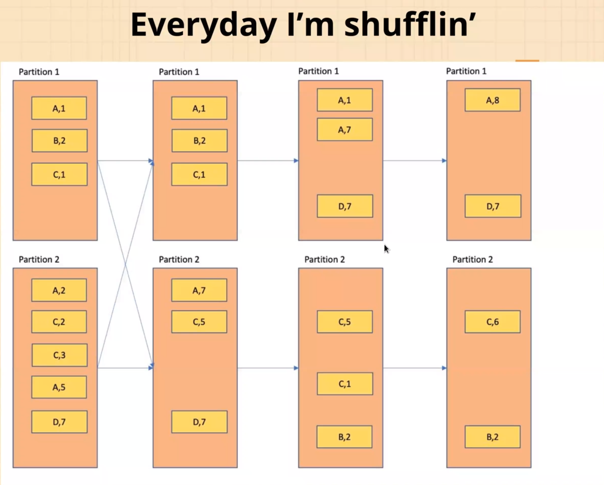

## Installation

docker images

~~~bash
docker pull itayb/spark:3.1.1-hadoop-3.2.0-aws
docker pull itayb/jupyter-notebook:6.2.0-spark-3.1.1-java-11-hadoop-3.2.0
~~~

## Конспекты:

### Сервисы Hadoop

#### Yarn

Является аналогом spark standalone scheduler, который запускается по умолчанию и входит в spark.

*Yarn* - resource manager, управляет запуском контейнеров, в которых уже и работают spark приложения

Приходит задача на запуск приложения. Resource manager поднимает первый контейнер - Application master.
В нём запускается первый instance приложения, который идёт к resource manager-у и запрашивает уже ресурсы на исполнение.
Например - ещё 3 контейнера. Тот опрашивает node manager-ы в поисках свободных ресурсов.
Application master получив список нод обращается к node manager-м уже за ресурсами и там тоже запускаются экземпляры
нашего приложения.

Note:
spark executor запускается в yarn контейнере, а application master контейнер уже содержит драйвер - своего рода
контроллер.
yarn executor - это дочерний процесс.

Разделение ресурсов происходит по очередям. Каждое приложение попадает в свою очередь.

#### Apache Oozie

*Apache Oozie* — это планировщик рабочих процессов для Hadoop. Это система, которая запускает рабочий процесс зависимых
заданий. Здесь пользователям разрешается создавать направленные циклические графы рабочих процессов, которые можно
запускать параллельно и последовательно в Hadoop. Оркестратор, в котором через xml описывается pipeline

#### MapReduce

#### ZooKeeper

*ZooKeeper* - каталог информации о кластере для сервисов

## Python vs Scala

Как работает Pyspark? Когда запускаем задачу на Spark - поднимаются JVM процессы. Ч
то происходит при обращении к RDD? Из JVM процессов через библиотеку PY4J будут осуществляться вызовы на python
интерпретаторах,
которые установлены на каждой ноде кластера и они будут работать совместно. Так как RDD API низкроуровневое -
по сути мы выполняем на каждом шаге какую-то функцию.
Соответственно, они будут выполняться в Python среде,
а основной код задачи в JVM => на каждом шаге будет происходить переключение контекста, по сути - пересылка данных
между python интерпретатором и JVM машиной.
Это очень дорого.

Python:

* Большое сообщество и много библиотек
* Низкая скорость работы RDD API:
* UDF - низкая скорость работы в DF API и Streaming API. (В большинстве своём)

Scala:

* Нестабильные ноутбуки, spark-shell и spark-sql работают не очень стабильно с большими объёмами, неудобно.
* Высокая скорость Spark API
* Scala UDF можно использовать в Pyspark: их можно написать, скомпилировать в jar, подключить и использовать

## RDD API

Количество executor на node? Стандартно - по количеству ядер. 
Каждый executor - отдельный процесс(один процесс, на одном ядре => одна задача).

Spark context, Spark session? Абстракция, которую возвращает библиотека для работы со спарком.

Driver разбивает код на стадии и они выстраиваются в граф. Spark решает задачу mapping этих стадий на железо, которое у нас есть.

## Dataframe

Быстрее чем RDD, за счёт sql оптимизаций.

## Партиционирование

